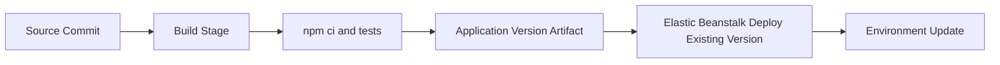

---
hide:
  - toc
---

# CI/CD for Node.js Elastic Beanstalk Deployments

## Prerequisites

- A Node.js application already deployable with EB CLI.
- Source repository connected to a CI platform.
- IAM roles permitting deployment of existing application versions.
- Build environment capable of running `npm ci`.

## What You'll Build

You will design a deployment pipeline that creates and promotes Elastic Beanstalk application versions. The workflow uses deterministic dependency installs in build, then deploys by referencing a previously built version.



## Steps

1. In your build stage, install dependencies with lockfile fidelity.

    ```bash
    npm ci
    npm test
    ```

2. Package and publish a source bundle as a versioned artifact.

3. Use deployment logic that targets an existing Elastic Beanstalk application version.

4. For AWS-native delivery, model the flow as CodePipeline plus CodeBuild.

5. For GitHub-hosted delivery, use GitHub Actions to run build and deployment commands with AWS credentials from secure secrets.

6. Apply environment promotion by deploying the same application version across environments.

7. Monitor deployment events and rollback signals.

    ```bash
    eb events
    eb status
    ```

8. Keep release metadata for each deployable artifact.

    - Git commit identifier.
    - Build timestamp.
    - Application version label used in Elastic Beanstalk.

9. Use immutable artifact promotion.

    - Build once in a trusted stage.
    - Reuse the same application version in higher stages.
    - Avoid rebuilding source during promotion.

10. Keep pipeline credentials least-privileged.

    - Scope deploy role permissions to required Elastic Beanstalk actions.
    - Restrict artifact bucket access to pipeline principals.
    - Rotate credentials and monitor usage.

## Verification

- Build stage uses `npm ci` and succeeds using lockfile dependencies.
- Application version is created and referenced during deployment.
- Deployment updates target environment without rebuilding source on deployment host.
- Deployment history shows clear version lineage for auditability.
- Promotion across environments references the same immutable version label.

## See Also

- [First Deployment](./02-first-deploy.md)
- [Logging and Monitoring](./04-logging-monitoring.md)
- [Infrastructure as Code](./05-infrastructure-as-code.md)

## Sources

- [Deploying an existing application version](https://docs.aws.amazon.com/elasticbeanstalk/latest/dg/using-features.deploy-existing-version.html)
