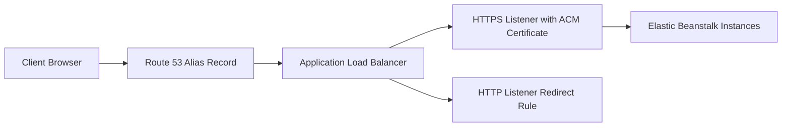

---
hide:
  - toc
---

# Custom Domain and HTTPS for Node.js Environments

## Prerequisites

- A running Elastic Beanstalk environment fronted by a load balancer.
- A registered domain name managed by Amazon Route 53 or delegated to it.
- AWS Certificate Manager certificate in the same region as the load balancer.
- Permission to modify load balancer listeners and Route 53 records.

## What You'll Build

You will attach a custom domain to your Elastic Beanstalk endpoint, terminate TLS with ACM on the load balancer, and configure HTTP to HTTPS redirect behavior for secure access.



## Steps

1. Request or import an ACM certificate for your domain names.

2. Configure Elastic Beanstalk environment to use a load balancer listener on `443` with that certificate.

3. Configure listener on `80` to redirect requests to `HTTPS`.

4. Create a Route 53 alias record that targets the load balancer DNS name for your environment.

5. Validate DNS propagation and certificate status before production cutover.

6. Test both `http://` and `https://` endpoints.

    ```bash
    curl --verbose http://app.example.com/
    curl --verbose https://app.example.com/
    ```

7. Validate certificate coverage for every host used by clients.

    - Apex domain (for example `example.com`).
    - Subdomain (for example `app.example.com`).
    - Optional wildcard names based on your DNS strategy.

8. Keep DNS cutover operationally safe.

    - Lower TTL before migration windows.
    - Verify alias target before traffic shift.
    - Confirm rollback record plan exists.

9. Confirm security posture after HTTPS enablement.

    - Redirect all plain HTTP requests.
    - Verify HSTS strategy if your policy requires it.
    - Ensure health checks still pass with listener changes.

10. Record endpoint and certificate metadata with masked identifiers.

    ```text
    Load balancer DNS: <env-load-balancer-dns>
    Certificate ARN: arn:aws:acm:<region>:<account-id>:certificate/<certificate-id>
    Hosted zone: <hosted-zone-id>
    ```

## Verification

- Route 53 alias resolves your custom domain to the environment load balancer.
- TLS certificate is issued and attached to the HTTPS listener.
- HTTP requests return redirect responses to HTTPS.
- HTTPS endpoint serves application responses with valid certificate chain.
- DNS and certificate metadata are documented with placeholders only.

## See Also

- [First Deployment](./02-first-deploy.md)
- [Configuration Guide](./03-configuration.md)
- [Platform Networking](../../platform/networking.md)

## Sources

- [Configuring HTTPS for your Elastic Beanstalk environment](https://docs.aws.amazon.com/elasticbeanstalk/latest/dg/configuring-https.html)
