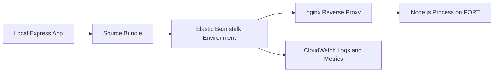

# Node.js on AWS Elastic Beanstalk

## Prerequisites

- Node.js 18 or later installed locally.
- npm available from the local Node.js installation.
- AWS CLI configured with credentials and default region.
- EB CLI installed and available in `PATH`.
- IAM permissions for Elastic Beanstalk, EC2, S3, CloudFormation, and CloudWatch.

## What You'll Build

You will build and deploy an Express application on AWS Elastic Beanstalk using the Node.js platform on Amazon Linux 2023. The path starts with local execution, then environment creation, and continues through operations topics such as configuration, logging, and delivery automation.



## Steps

1. Validate local tooling and credentials.

    ```bash
    node --version
    npm --version
    aws --version
    eb --version
    aws sts get-caller-identity
    ```

2. Review the Node.js tutorial sequence.

    | File | Focus | Key AWS Topic |
    |---|---|---|
    | `01-local-run.md` | Express app locally | `process.env.PORT` and package metadata |
    | `02-first-deploy.md` | First Elastic Beanstalk deployment | `eb init`, `eb create`, `eb deploy` |
    | `03-configuration.md` | Runtime and platform configuration | environment properties, `.ebextensions`, hooks |
    | `04-logging-monitoring.md` | Logs and observability | CloudWatch Logs and metrics |
    | `05-infrastructure-as-code.md` | Reproducible infrastructure | saved configs and resources |
    | `06-ci-cd.md` | Continuous delivery patterns | deploy existing application versions |
    | `07-custom-domain-ssl.md` | HTTPS and DNS | Route 53 alias and ACM with load balancer |
    | `nodejs-runtime.md` | Platform runtime behavior | Node versions, proxy, static files |

3. Review recipe tutorials for common integrations.

    | Recipe | Outcome |
    |---|---|
    | `recipes/rds-integration.md` | Attach decoupled Amazon RDS and connect with environment properties |
    | `recipes/elasticache-redis.md` | Use Amazon ElastiCache for Redis from your application tier |
    | `recipes/s3-storage.md` | Integrate Amazon S3 with IAM instance profile permissions |
    | `recipes/custom-platform-hooks.md` | Extend platform behavior with `.platform` hooks and nginx fragments |
    | `recipes/worker-environments.md` | Run asynchronous workloads with worker tier and Amazon SQS |
    | `recipes/docker-deploy.md` | Package Node.js in a Docker container for Elastic Beanstalk |

4. Follow each page in sequence and complete verification checks before moving forward.

## Verification

- Confirm the required tools are installed and return version output.
- Confirm AWS identity returns a masked account placeholder in documentation examples:

    ```text
    {
        "UserId": "AIDAXXXXXXXXXXXXXXXX",
        "Account": "<account-id>",
        "Arn": "arn:aws:iam::<account-id>:user/<user-name>"
    }
    ```

- Confirm you can open the next tutorial page and execute commands in order.

## See Also

- [Language Guides Index](../index.md)
- [Node.js Runtime Details](./nodejs-runtime.md)
- [Node.js Recipes](./recipes/index.md)
- [Platform Overview](../../platform/index.md)

## Sources

- [Deploying Node.js applications to Elastic Beanstalk](https://docs.aws.amazon.com/elasticbeanstalk/latest/dg/create_deploy_nodejs.html)
- [Node.js platform on Amazon Linux 2 and Amazon Linux 2023](https://docs.aws.amazon.com/elasticbeanstalk/latest/dg/nodejs-platform-al2.html)
- [Elastic Beanstalk Developer Guide](https://docs.aws.amazon.com/elasticbeanstalk/latest/dg/Welcome.html)
