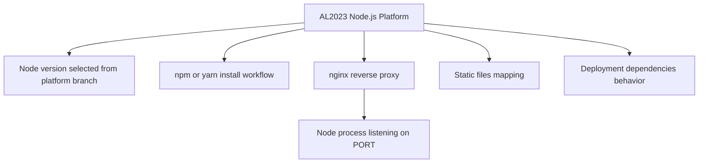

---
hide:
  - toc
---

# Node.js Runtime Reference on Elastic Beanstalk

## Prerequisites

- Working Node.js Elastic Beanstalk web server environment.
- Familiarity with project files `package.json`, `Procfile`, and `.platform`.
- Access to platform branch configuration in Elastic Beanstalk.
- Understanding of reverse proxy behavior in front of Node.js processes.

## What You'll Build

You will map runtime behaviors for Node.js on Amazon Linux 2023: supported Node versions, dependency managers, nginx proxy integration, static file mapping, and package installation controls including `.npmrc` and `node_modules` handling.



## Steps

1. Select a platform branch that supports your required Node.js runtime generation.

2. Pin runtime expectations in `package.json`.

    ```json
    {
        "engines": {
            "node": ">=18"
        }
    }
    ```

3. Understand dependency manager behavior.

    - npm is used by default when `package-lock.json` and npm metadata are present.
    - Yarn can be used when project metadata indicates Yarn-based dependency workflows.

4. Confirm app process binds to Elastic Beanstalk provided port.

    ```javascript
    const port = process.env.PORT || 8080;
    app.listen(port);
    ```

5. Customize reverse proxy and static file behavior when needed.

    - nginx is in front of the application process by default.
    - Static file mappings can be configured to serve assets efficiently from proxy layer.
    - Proxy customization can be added via `.platform/nginx/`.

6. Apply package install controls in repository configuration.

    - Use `.npmrc` for npm install behavior settings as needed.
    - Understand whether `node_modules` should be included or regenerated during deployment.

7. Deploy and validate runtime behavior.

    ```bash
    eb deploy
    eb logs
    ```

## Verification

- Environment runs on expected Node.js platform generation.
- Dependency installation behavior matches package manager strategy.
- nginx proxies requests to application process bound on `process.env.PORT`.
- Static assets and proxy customizations load without health check regressions.
- Installation settings from `.npmrc` are reflected during deployment.

## See Also

- [Configuration Guide](./03-configuration.md)
- [Local Run Tutorial](./01-local-run.md)
- [Custom Platform Hooks Recipe](./recipes/custom-platform-hooks.md)

## Sources

- [Node.js platform on Amazon Linux 2 and Amazon Linux 2023](https://docs.aws.amazon.com/elasticbeanstalk/latest/dg/nodejs-platform-al2.html)
