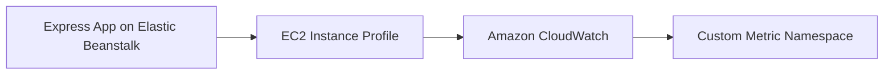

# Publish Custom CloudWatch Metrics from Node.js on Elastic Beanstalk

This recipe shows how to publish custom CloudWatch metrics from an Express application by using AWS SDK v3. It helps you track app-specific behavior such as orders created, jobs queued, or cache misses.

## Prerequisites

- Running Node.js Elastic Beanstalk environment.
- IAM permission for `cloudwatch:PutMetricData`.
- `@aws-sdk/client-cloudwatch` installed.

## What You'll Build

You will build an Express endpoint that publishes a custom metric to CloudWatch when a tracked action occurs.



## Steps

### Step 1: Install the CloudWatch client

```bash
npm install @aws-sdk/client-cloudwatch
```

### Step 2: Add a metric namespace in environment properties

```bash
aws elasticbeanstalk update-environment \
    --application-name "$APP_NAME" \
    --environment-name "$ENV_NAME" \
    --option-settings Namespace=aws:elasticbeanstalk:application:environment,OptionName=CW_NAMESPACE,Value="$APP_NAME/Application" \
    --region "$REGION"
```

### Step 3: Publish a metric from the application

```javascript
const express = require("express");
const {
    CloudWatchClient,
    PutMetricDataCommand
} = require("@aws-sdk/client-cloudwatch");

const app = express();
const client = new CloudWatchClient({ region: process.env.AWS_REGION });

app.post("/orders", async (req, res) => {
    await client.send(new PutMetricDataCommand({
        Namespace: process.env.CW_NAMESPACE,
        MetricData: [
            {
                MetricName: "OrdersCreated",
                Unit: "Count",
                Value: 1,
                Dimensions: [
                    { Name: "EnvironmentName", Value: process.env.ENV_NAME }
                ]
            }
        ]
    }));

    res.status(202).json({ status: "metric-published" });
});
```

### Step 4: Add the environment name as an environment property

```bash
aws elasticbeanstalk update-environment \
    --application-name "$APP_NAME" \
    --environment-name "$ENV_NAME" \
    --option-settings Namespace=aws:elasticbeanstalk:application:environment,OptionName=ENV_NAME,Value="$ENV_NAME" \
    --region "$REGION"
```

### Step 5: Deploy and trigger the metric

```bash
eb deploy --staged
curl --request POST "http://$CNAME/orders"
```

## Verification

```bash
aws cloudwatch list-metrics \
    --namespace "$APP_NAME/Application" \
    --region "$REGION"
```

Expected result: CloudWatch lists the `OrdersCreated` metric after the route is called.

## Clean Up

Remove the custom metric publishing path and related IAM permission if you no longer need the integration. Old custom metrics expire automatically when data stops arriving.

## See Also

- [Node.js Recipes Index](./index.md)
- [IAM Instance Profile Recipe](./iam-instance-profile.md)
- [Operations Section](../../../operations/index.md)

## Sources

- [Publishing Metrics in Amazon CloudWatch](https://docs.aws.amazon.com/AmazonCloudWatch/latest/monitoring/publishingMetrics.html)
- [AWS SDK for JavaScript v3 CloudWatch Examples](https://docs.aws.amazon.com/sdk-for-javascript/v3/developer-guide/javascript_cloudwatch_code_examples.html)
- [Elastic Beanstalk Health and Monitoring](https://docs.aws.amazon.com/elasticbeanstalk/latest/dg/health-enhanced.html)
