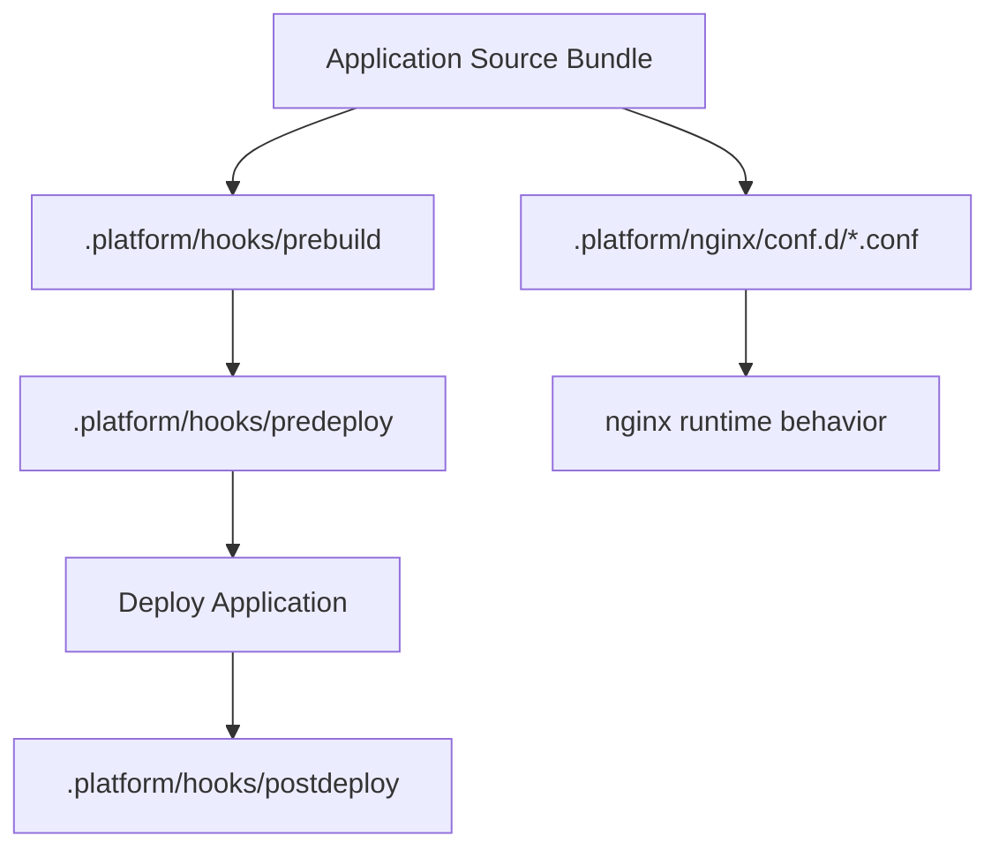

# Recipe: Custom Platform Hooks and nginx Extensions

## Prerequisites

- Elastic Beanstalk Node.js environment on Linux platform.
- Repository access to add `.platform` directory content.
- Shell scripting familiarity for lifecycle hook scripts.
- Awareness of deployment sequence and rollback behavior.

## What You'll Build

You will extend platform behavior by adding lifecycle hook scripts under `.platform/hooks` and reverse proxy fragments under `.platform/nginx`, enabling custom validation, migration, and response handling logic.



## Steps

1. Create lifecycle hook script files with executable permissions.

    ```text
    .platform/hooks/prebuild/10-check-env.sh
    .platform/hooks/predeploy/20-run-migrations.sh
    .platform/hooks/postdeploy/30-smoke.sh
    ```

2. Keep scripts idempotent and fail-fast on unrecoverable conditions.

3. Add nginx custom configuration snippets in `.platform/nginx/conf.d/`.

    ```nginx
    add_header X-Content-Type-Options "nosniff" always;
    add_header X-Frame-Options "DENY" always;
    ```

4. Deploy and inspect deployment logs for hook execution order.

    ```bash
    eb deploy
    eb logs
    ```

5. Validate nginx behavior by issuing HTTP requests.

    ```bash
    curl --verbose https://<env-domain>/
    ```

6. Keep hook scripts compatible with Linux shell execution in Elastic Beanstalk instances.

    - Add explicit shebang lines.
    - Use executable file permissions.
    - Avoid assumptions about interactive shell input.

7. Document the operational purpose of each hook.

    - Validation.
    - Migration.
    - Post-deploy smoke checks.

## Verification

- Hook scripts run at expected lifecycle stages.
- Deployment fails early when preconditions are not met.
- nginx snippets are loaded without syntax errors.
- Response headers or routing behaviors reflect custom config.
- Hook intent and failure modes are documented for operators.

## See Also

- [Node.js Configuration](../03-configuration.md)
- [Node.js Runtime Reference](../nodejs-runtime.md)
- [Custom Domain and SSL](../07-custom-domain-ssl.md)

## Sources

- [Extending Elastic Beanstalk Linux platforms](https://docs.aws.amazon.com/elasticbeanstalk/latest/dg/platforms-linux-extend.html)
