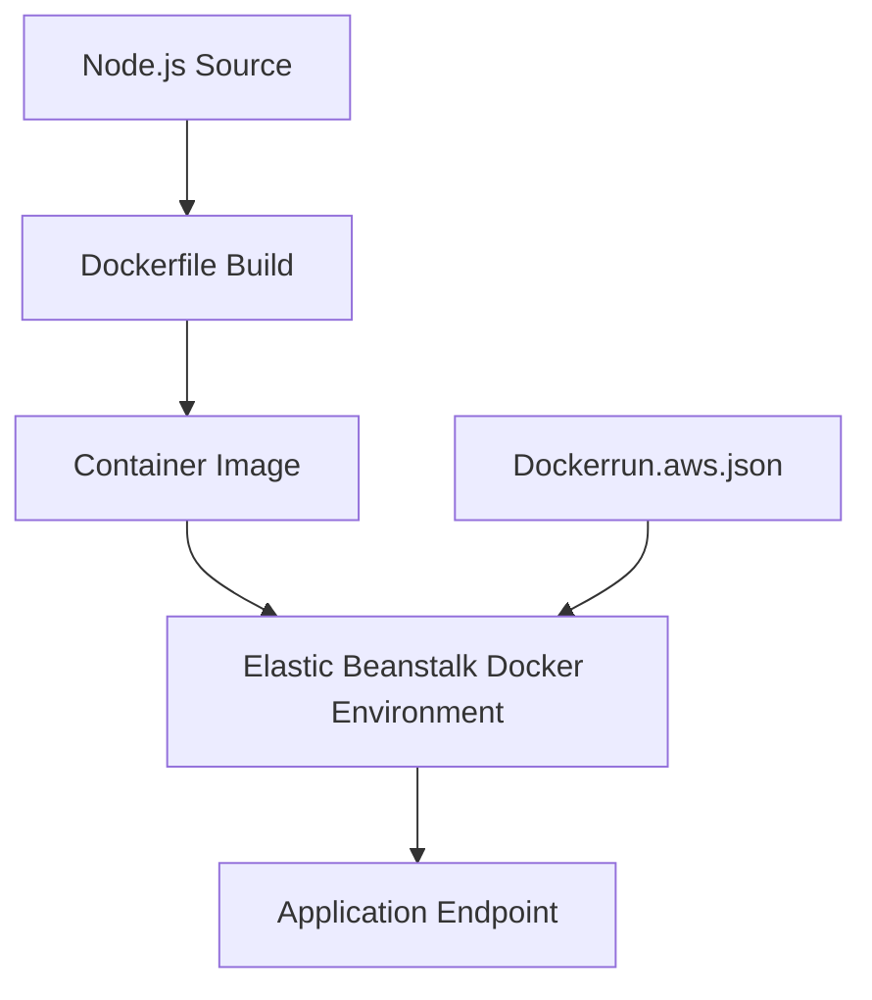

---
hide:
  - toc
---

# Recipe: Deploy Node.js with Docker on Elastic Beanstalk

## Prerequisites

- Node.js application prepared for container packaging.
- Elastic Beanstalk Docker platform target environment.
- Docker tooling available locally for image testing.
- Understanding of `Dockerfile` and `Dockerrun.aws.json` options.

## What You'll Build

You will package a Node.js app into a Docker image for single-container Elastic Beanstalk deployments and understand how `Dockerrun.aws.json` can describe container deployment metadata.



## Steps

1. Create a `Dockerfile` for your Node.js web process.

    ```dockerfile
    FROM public.ecr.aws/docker/library/node:18

    WORKDIR /usr/src/app
    COPY package*.json ./
    RUN npm ci --omit=dev
    COPY . .

    ENV PORT=8080
    EXPOSE 8080
    CMD ["npm", "start"]
    ```

2. Build and test the image locally.

    ```bash
    docker build --tag eb-nodejs-docker:latest .
    docker run --publish 8080:8080 eb-nodejs-docker:latest
    ```

3. Prepare deployment descriptor if using `Dockerrun.aws.json` format.

4. Initialize or update Elastic Beanstalk environment on Docker platform branch.

5. Deploy containerized application version.

    ```bash
    eb deploy
    ```

6. Validate endpoint behavior and logs.

7. Keep image build deterministic for repeatable deployments.

    - Use explicit base image tags.
    - Use lockfile-based dependency installation.
    - Keep build context minimal to reduce drift.

8. Capture platform-level metadata for operations runbooks.

    ```text
    Platform: Docker running on 64bit Amazon Linux 2023
    Image Tag: <image-tag>
    Application Version: <version-label>
    ```

## Verification

- Container image builds successfully from repository source.
- Application listens on container port compatible with environment routing.
- Elastic Beanstalk deployment succeeds on Docker platform.
- Endpoint returns expected application response after deployment.
- Deployment metadata is recorded with placeholder identifiers.

## See Also

- [Node.js Runtime Reference](../nodejs-runtime.md)
- [CI/CD Guide](../06-ci-cd.md)
- [Custom Platform Hooks Recipe](./custom-platform-hooks.md)

## Sources

- [Single container Docker environments on Elastic Beanstalk](https://docs.aws.amazon.com/elasticbeanstalk/latest/dg/single-container-docker.html)
