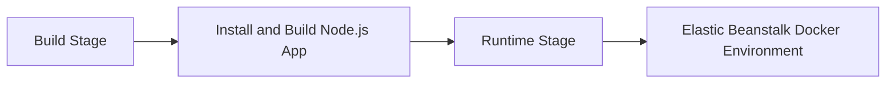

# Use Docker Multi-Stage Builds for Node.js on Elastic Beanstalk

This recipe shows how to build a smaller runtime image for a Node.js application by using Docker multi-stage builds. It keeps build tooling in an earlier stage while shipping only the compiled app and production dependencies to Elastic Beanstalk.

## Prerequisites

- Docker-based Elastic Beanstalk environment.
- Node.js application with a production start command.
- Docker installed locally.

## What You'll Build

You will build a multi-stage Docker image for Elastic Beanstalk that separates dependency installation and application build from runtime execution.



## Steps

### Step 1: Create a multi-stage Dockerfile

```dockerfile
FROM public.ecr.aws/docker/library/node:20-alpine AS build

WORKDIR /app
COPY package*.json ./
RUN npm ci
COPY . .
RUN npm run build --if-present && npm prune --omit=dev

FROM public.ecr.aws/docker/library/node:20-alpine

WORKDIR /app
ENV NODE_ENV=production
COPY --from=build /app /app
CMD ["npm", "start"]
```

### Step 2: Add a `.dockerignore` file

```text
.git
node_modules
npm-debug.log
docs
```

### Step 3: Build the image locally

```bash
docker build --tag "$APP_NAME-node:local" .
```

### Step 4: Run the image with the expected port

```bash
docker run --rm --publish 8080:8080 --env PORT=8080 "$APP_NAME-node:local"
```

### Step 5: Deploy to Elastic Beanstalk

```bash
eb deploy --staged
```

## Verification

```bash
docker images "$APP_NAME-node:local"
curl --verbose "http://127.0.0.1:8080/"
eb health --refresh
```

Expected result: the container starts locally and the Elastic Beanstalk Docker environment reports healthy after deployment.

## Clean Up

Remove the local test image and any temporary Docker platform environment created only for validation.

## See Also

- [Node.js Recipes Index](./index.md)
- [Docker Deploy Recipe](./docker-deploy.md)
- [Node.js Runtime Reference](../nodejs-runtime.md)

## Sources

- [Elastic Beanstalk Docker Platform](https://docs.aws.amazon.com/elasticbeanstalk/latest/dg/create_deploy_docker.html)
- [Dockerfile Reference](https://docs.docker.com/reference/dockerfile/)
- [Deploying a Node.js Application with Elastic Beanstalk](https://docs.aws.amazon.com/elasticbeanstalk/latest/dg/create_deploy_nodejs.container.html)
