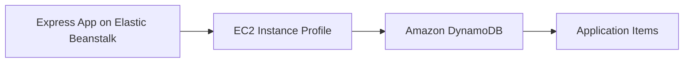

# Use Amazon DynamoDB with Node.js on Elastic Beanstalk

This recipe shows how to integrate an Express application with Amazon DynamoDB by using AWS SDK v3. It is a good fit for key-value lookups, event metadata, and lightweight application state.

## Prerequisites

- Running Node.js Elastic Beanstalk environment.
- IAM permission for `dynamodb:GetItem`, `dynamodb:PutItem`, and `dynamodb:DescribeTable`.
- Existing DynamoDB table or permission to create one.
- `@aws-sdk/client-dynamodb` installed.

## What You'll Build

You will build simple read and write endpoints backed by a DynamoDB table.



## Steps

### Step 1: Install the DynamoDB client

```bash
npm install @aws-sdk/client-dynamodb
```

### Step 2: Create or identify the DynamoDB table

```bash
aws dynamodb create-table \
    --table-name "$APP_NAME-items" \
    --attribute-definitions AttributeName=item_id,AttributeType=S \
    --key-schema AttributeName=item_id,KeyType=HASH \
    --billing-mode PAY_PER_REQUEST \
    --region "$REGION"
```

### Step 3: Add the table name to environment properties

```bash
aws elasticbeanstalk update-environment \
    --application-name "$APP_NAME" \
    --environment-name "$ENV_NAME" \
    --option-settings Namespace=aws:elasticbeanstalk:application:environment,OptionName=DDB_TABLE_NAME,Value="$APP_NAME-items" \
    --region "$REGION"
```

### Step 4: Read and write items from Express

```javascript
const express = require("express");
const {
    DynamoDBClient,
    GetItemCommand,
    PutItemCommand
} = require("@aws-sdk/client-dynamodb");

const app = express();
const client = new DynamoDBClient({ region: process.env.AWS_REGION });

app.use(express.json());

app.post("/items", async (req, res) => {
    await client.send(new PutItemCommand({
        TableName: process.env.DDB_TABLE_NAME,
        Item: {
            item_id: { S: req.body.item_id },
            value: { S: req.body.value }
        }
    }));
    res.status(201).json({ status: "stored" });
});

app.get("/items/:itemId", async (req, res) => {
    const response = await client.send(new GetItemCommand({
        TableName: process.env.DDB_TABLE_NAME,
        Key: { item_id: { S: req.params.itemId } }
    }));
    res.json(response.Item || {});
});
```

### Step 5: Deploy and test

```bash
eb deploy --staged
```

## Verification

```bash
curl --request POST \
    --header "Content-Type: application/json" \
    --data '{"item_id":"sample-1","value":"hello"}' \
    "http://$CNAME/items"

curl --verbose "http://$CNAME/items/sample-1"
```

Expected result: requests write and read back the item through DynamoDB.

## Clean Up

Delete the test table, remove the IAM policy statement, and remove the `DDB_TABLE_NAME` environment property if the integration was only temporary.

## See Also

- [Node.js Recipes Index](./index.md)
- [IAM Instance Profile Recipe](./iam-instance-profile.md)
- [Node.js Configuration](../03-configuration.md)

## Sources

- [Amazon DynamoDB Developer Guide](https://docs.aws.amazon.com/amazondynamodb/latest/developerguide/Introduction.html)
- [AWS SDK for JavaScript v3 DynamoDB Examples](https://docs.aws.amazon.com/sdk-for-javascript/v3/developer-guide/javascript_dynamodb_code_examples.html)
- [Elastic Beanstalk Environment Properties](https://docs.aws.amazon.com/elasticbeanstalk/latest/dg/environments-cfg-softwaresettings.html)
