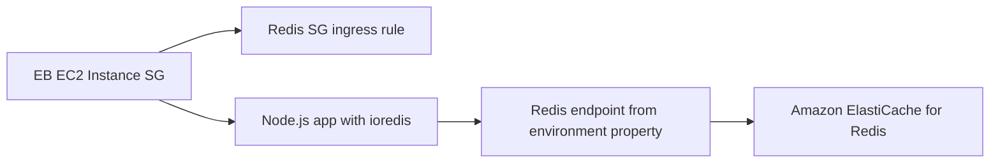

---
hide:
  - toc
---

# Recipe: Add ElastiCache for Redis to Node.js

## Prerequisites

- Running Node.js Elastic Beanstalk environment in a VPC.
- Amazon ElastiCache for Redis cluster or replication group.
- Security groups and subnets configured for private connectivity.
- Node.js Redis client dependency such as `ioredis`.

## What You'll Build

You will connect your Elastic Beanstalk Node.js application to an Amazon ElastiCache for Redis endpoint using environment properties, VPC routing, and security group rules that permit app-to-cache traffic.



## Steps

1. Provision ElastiCache for Redis in the same VPC as your environment.

2. Configure security groups.

    - Allow outbound traffic from Elastic Beanstalk instance security group.
    - Allow inbound Redis port traffic to ElastiCache security group from app security group.

3. Add Redis endpoint values as environment properties.

    ```text
    REDIS_HOST=<redis-endpoint>
    REDIS_PORT=6379
    ```

4. Install and configure `ioredis` in your Node.js project.

    ```bash
    npm install ioredis
    ```

    ```javascript
    const Redis = require("ioredis");

    const redis = new Redis({
        host: process.env.REDIS_HOST,
        port: Number(process.env.REDIS_PORT || 6379)
    });
    ```

5. Add a lightweight cache read or write endpoint for verification.

6. Deploy and validate Redis operations from application instances.

7. Protect cache availability with conservative client settings.

    - Set reasonable command timeouts.
    - Limit retry storms during endpoint instability.
    - Handle connection errors without crashing request workers.

8. Confirm subnet and route alignment.

    - ElastiCache nodes in private subnets.
    - Application instances with network path to cache subnets.
    - No unnecessary public exposure for cache endpoint.

## Verification

- Environment properties expose cache endpoint values to runtime.
- Application instances establish successful Redis connection.
- Security group configuration enforces scoped network access.
- Cache set and get operations succeed through application endpoint.
- Network and timeout settings support stable runtime behavior.

## See Also

- [RDS Integration Recipe](./rds-integration.md)
- [Node.js Runtime Reference](../nodejs-runtime.md)
- [Platform Networking](../../../platform/networking.md)

## Sources

- [Using Elastic Beanstalk with Amazon ElastiCache](https://docs.aws.amazon.com/elasticbeanstalk/latest/dg/AWSHowTo.ElastiCache.html)
