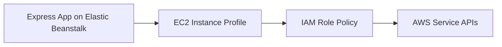

# Use IAM Instance Profiles with Node.js on Elastic Beanstalk

This recipe shows how to grant Node.js applications access to AWS APIs by attaching an IAM instance profile to Elastic Beanstalk instances. It replaces static access keys with short-lived credentials delivered by the EC2 metadata service.

## Prerequisites

- Running Node.js Elastic Beanstalk environment.
- Permission to create and manage IAM roles and instance profiles.
- Target AWS services identified for the application.

## What You'll Build

You will build a Node.js environment that can call AWS APIs by using the instance role attached to the Elastic Beanstalk EC2 instances.



## Steps

### Step 1: Create the IAM role and trust policy

```bash
aws iam create-role \
    --role-name "$APP_NAME-eb-node-role" \
    --assume-role-policy-document file://trust-policy.json
```

### Step 2: Create the instance profile and add the role

```bash
aws iam create-instance-profile \
    --instance-profile-name "$APP_NAME-eb-node-profile"

aws iam add-role-to-instance-profile \
    --instance-profile-name "$APP_NAME-eb-node-profile" \
    --role-name "$APP_NAME-eb-node-role"
```

### Step 3: Attach least-privilege permissions for the app

```bash
aws iam put-role-policy \
    --role-name "$APP_NAME-eb-node-role" \
    --policy-name "$APP_NAME-node-access" \
    --policy-document file://app-access-policy.json
```

### Step 4: Update the environment to use the instance profile

```bash
aws elasticbeanstalk update-environment \
    --application-name "$APP_NAME" \
    --environment-name "$ENV_NAME" \
    --option-settings Namespace=aws:autoscaling:launchconfiguration,OptionName=IamInstanceProfile,Value="$APP_NAME-eb-node-profile" \
    --region "$REGION"
```

### Step 5: Confirm identity from application code

```javascript
const express = require("express");
const { GetCallerIdentityCommand, STSClient } = require("@aws-sdk/client-sts");

const app = express();
const client = new STSClient({});

app.get("/identity-check", async (req, res) => {
    const response = await client.send(new GetCallerIdentityCommand({}));
    res.json({ arn: response.Arn });
});
```

## Verification

```bash
npm install @aws-sdk/client-sts
eb deploy --staged
curl --verbose "http://$CNAME/identity-check"
```

Expected result: the route returns the instance profile role identity rather than a static access key identity.

## Clean Up

Remove the instance profile from the environment, then delete the test role, inline policy, and instance profile.

## See Also

- [Node.js Recipes Index](./index.md)
- [Node.js Runtime Reference](../nodejs-runtime.md)
- [Operations Section](../../../operations/index.md)

## Sources

- [Managing Elastic Beanstalk Instance Profiles](https://docs.aws.amazon.com/elasticbeanstalk/latest/dg/iam-instanceprofile.html)
- [IAM Roles for Amazon EC2](https://docs.aws.amazon.com/AWSEC2/latest/UserGuide/iam-roles-for-amazon-ec2.html)
- [AWS SDK for JavaScript v3 STS Examples](https://docs.aws.amazon.com/sdk-for-javascript/v3/developer-guide/javascript_sts_code_examples.html)
