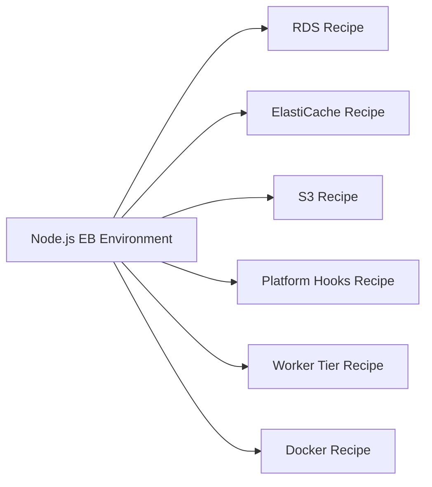

# Node.js Recipes for Elastic Beanstalk

## Prerequisites

- Completed the core Node.js tutorial sequence.
- Working Elastic Beanstalk application and at least one environment.
- Access to AWS service integrations used by each recipe.
- Ability to redeploy and validate changes safely.

## What You'll Build

You will apply focused implementation recipes that extend a Node.js Elastic Beanstalk deployment: data tier integration, caching, object storage, platform customization, worker tiers, and container-based packaging.

## Steps

1. Choose a recipe aligned with your current delivery milestone.

2. Follow the table to navigate recipes by goal.

    | Recipe File | Goal | Primary AWS Service |
    |---|---|---|
    | `rds-integration.md` | Connect app to managed relational database | Amazon RDS |
    | `elasticache-redis.md` | Add low-latency cache and session backing | Amazon ElastiCache for Redis |
    | `s3-storage.md` | Store and retrieve objects securely | Amazon S3 |
    | `custom-platform-hooks.md` | Extend deployment lifecycle and proxy behavior | Elastic Beanstalk Platform Hooks |
    | `worker-environments.md` | Process async jobs from queue | Elastic Beanstalk Worker Tier + Amazon SQS |
    | `docker-deploy.md` | Deploy containerized Node.js workload | Elastic Beanstalk Docker Platform |

3. Apply one recipe at a time to keep rollback and validation simple.

4. Run each recipe's verification checklist before proceeding to the next integration.

5. Use a progressive rollout strategy across environments.

    - Validate recipe in development first.
    - Promote to staging with production-like traffic patterns.
    - Apply to production after explicit verification evidence.

6. Track recipe ownership and rollback plans.

    - Define service owner per integration.
    - Capture dependency and blast radius assumptions.
    - Keep removal steps documented for emergency rollback.

7. Preserve consistency with Elastic Beanstalk platform conventions.

    - Keep application listening on `process.env.PORT`.
    - Keep reverse proxy assumptions aligned with nginx defaults.
    - Keep environment properties as primary runtime configuration channel.

8. Record a concise implementation note per recipe rollout.

    - Date and environment name.
    - Applied configuration files.
    - Verification commands and outcomes.

## Verification

- Recipe selection is tied to a specific architectural need.
- Integration changes are tracked and deployed independently.
- Post-deploy checks pass for service connectivity and application health.
- Rollback steps are documented for each applied recipe.

## See Also

- [Node.js Guide Index](../index.md)
- [Node.js Runtime Reference](../nodejs-runtime.md)
- [Operations Section](../../../operations/index.md)

## Sources

- [Elastic Beanstalk Developer Guide](https://docs.aws.amazon.com/elasticbeanstalk/latest/dg/Welcome.html)
