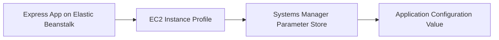

# Use Systems Manager Parameter Store with Node.js on Elastic Beanstalk

This recipe shows how to read application configuration values from Systems Manager Parameter Store by using AWS SDK v3. It is useful when multiple environments should reference centrally managed configuration names instead of duplicating values.

## Prerequisites

- Running Node.js Elastic Beanstalk environment.
- IAM permission for `ssm:GetParameter` and `kms:Decrypt` if using `SecureString` parameters.
- `@aws-sdk/client-ssm` installed.
- Existing parameter in Systems Manager Parameter Store.

## What You'll Build

You will build an Express route that fetches a parameter value at runtime from Parameter Store.



## Steps

### Step 1: Install the Systems Manager client

```bash
npm install @aws-sdk/client-ssm
```

### Step 2: Create or identify a parameter

```bash
aws ssm put-parameter \
    --name "/$APP_NAME/config/api-base-url" \
    --type String \
    --value "https://api.example.internal" \
    --overwrite \
    --region "$REGION"
```

### Step 3: Store the parameter name in environment properties

```bash
aws elasticbeanstalk update-environment \
    --application-name "$APP_NAME" \
    --environment-name "$ENV_NAME" \
    --option-settings Namespace=aws:elasticbeanstalk:application:environment,OptionName=API_BASE_URL_PARAMETER,Value="/$APP_NAME/config/api-base-url" \
    --region "$REGION"
```

### Step 4: Fetch the parameter in Express

```javascript
const express = require("express");
const { GetParameterCommand, SSMClient } = require("@aws-sdk/client-ssm");

const app = express();
const client = new SSMClient({ region: process.env.AWS_REGION });

app.get("/config-check", async (req, res) => {
    const response = await client.send(new GetParameterCommand({
        Name: process.env.API_BASE_URL_PARAMETER,
        WithDecryption: true
    }));

    res.json({ apiBaseUrl: response.Parameter.Value });
});
```

### Step 5: Deploy and test

```bash
eb deploy --staged
curl --verbose "http://$CNAME/config-check"
```

## Verification

- Confirm the environment property contains the expected parameter name.
- Confirm the route returns the Parameter Store value.
- Confirm logs show successful Systems Manager access.

## Clean Up

Delete the test parameter and remove any IAM policy statement or environment property added for the recipe if it is no longer needed.

## See Also

- [Node.js Recipes Index](./index.md)
- [Secrets Manager Recipe](./secrets-manager.md)
- [VPC Endpoints Recipe](./vpc-endpoints.md)

## Sources

- [AWS Systems Manager Parameter Store](https://docs.aws.amazon.com/systems-manager/latest/userguide/systems-manager-parameter-store.html)
- [AWS SDK for JavaScript v3 Systems Manager Examples](https://docs.aws.amazon.com/sdk-for-javascript/v3/developer-guide/javascript_ssm_code_examples.html)
- [Elastic Beanstalk Environment Properties](https://docs.aws.amazon.com/elasticbeanstalk/latest/dg/environments-cfg-softwaresettings.html)
