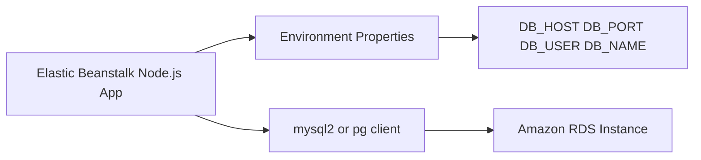

---
hide:
  - toc
---

# Recipe: Integrate Node.js with Amazon RDS

## Prerequisites

- Running Elastic Beanstalk Node.js environment.
- Amazon RDS database created separately from the environment for decoupling.
- Network connectivity between application instances and database endpoint.
- Node.js database client package such as `mysql2` or `pg`.

## What You'll Build

You will connect a decoupled Amazon RDS database to your Node.js app by injecting connection details through Elastic Beanstalk environment properties and initializing a reusable connection pool in application code.



## Steps

1. Create or identify an existing decoupled RDS instance.

2. Add database connection values as Elastic Beanstalk environment properties.

    ```text
    DB_HOST=<db-endpoint>
    DB_PORT=5432
    DB_USER=<db-user>
    DB_PASSWORD=<db-password>
    DB_NAME=<db-name>
    ```

3. Install the client dependency for your engine.

    ```bash
    npm install pg
    ```

4. Initialize connection logic using environment variables.

    ```javascript
    const { Pool } = require("pg");

    const pool = new Pool({
        host: process.env.DB_HOST,
        port: Number(process.env.DB_PORT || 5432),
        user: process.env.DB_USER,
        password: process.env.DB_PASSWORD,
        database: process.env.DB_NAME
    });

    module.exports = { pool };
    ```

5. Add an application health endpoint that validates DB reachability.

6. Deploy and test queries against the environment endpoint.

    ```bash
    eb deploy
    eb health --refresh
    ```

## Verification

- Environment properties are set and available through `process.env`.
- Application can establish a database connection from instances.
- Security groups allow least-privilege access from app tier to RDS port.
- DB connectivity check endpoint passes after deployment.

## See Also

- [Node.js Configuration](../03-configuration.md)
- [S3 Storage Recipe](./s3-storage.md)
- [Worker Environment Recipe](./worker-environments.md)

## Sources

- [Using Amazon RDS with Node.js and Elastic Beanstalk](https://docs.aws.amazon.com/elasticbeanstalk/latest/dg/create-deploy-nodejs.rds.html)
