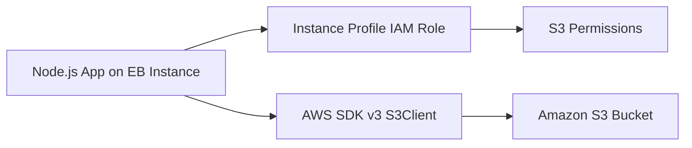

---
hide:
  - toc
---

# Recipe: Use Amazon S3 from Node.js on Elastic Beanstalk

## Prerequisites

- Running Node.js Elastic Beanstalk environment.
- IAM instance profile attached to environment instances.
- Amazon S3 bucket for object storage.
- AWS SDK for JavaScript v3 dependency in your project.

## What You'll Build

You will grant least-privilege S3 access through instance profile IAM policy and implement object upload and retrieval operations in your Node.js app using AWS SDK v3 S3 client.



## Steps

1. Create or select an S3 bucket for application objects.

2. Attach IAM policy permissions for required bucket actions to the instance profile role.

3. Install AWS SDK v3 S3 modules.

    ```bash
    npm install @aws-sdk/client-s3
    ```

4. Add bucket name as environment property.

    ```text
    APP_BUCKET_NAME=<bucket-name>
    ```

5. Implement upload operation in application code.

    ```javascript
    const { S3Client, PutObjectCommand } = require("@aws-sdk/client-s3");

    const s3 = new S3Client({});

    async function putObject(key, body) {
        await s3.send(new PutObjectCommand({
            Bucket: process.env.APP_BUCKET_NAME,
            Key: key,
            Body: body
        }));
    }
    ```

6. Deploy and test object operations through an application endpoint.

7. Keep bucket policy and IAM role permissions aligned.

    - Grant only required actions.
    - Scope resources to specific bucket paths when possible.
    - Avoid wildcard permissions beyond operational need.

8. Validate request patterns for uploads and downloads.

    - Small text object write.
    - Read-back of the same key.
    - Error handling for missing object keys.

## Verification

- Instance profile includes scoped S3 permissions.
- Application can write and read objects in configured bucket.
- No static credentials are stored in source code.
- Bucket name is provided through environment property.
- IAM policy scope matches minimum required S3 actions.

## See Also

- [RDS Integration Recipe](./rds-integration.md)
- [ElastiCache Redis Recipe](./elasticache-redis.md)
- [Configuration Guide](../03-configuration.md)

## Sources

- [Using Elastic Beanstalk with Amazon S3](https://docs.aws.amazon.com/elasticbeanstalk/latest/dg/AWSHowTo.S3.html)
