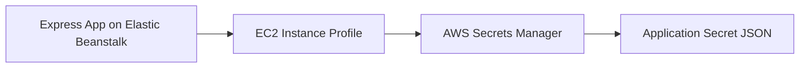

# Use AWS Secrets Manager with Node.js on Elastic Beanstalk

This recipe shows how to load secrets at runtime from AWS Secrets Manager by using the AWS SDK for JavaScript v3. It keeps sensitive values out of repository files and reduces secret sprawl across environments.

## Prerequisites

- Running Node.js Elastic Beanstalk environment.
- Instance profile permission for `secretsmanager:GetSecretValue`.
- Existing secret in AWS Secrets Manager.
- `@aws-sdk/client-secrets-manager` installed.

## What You'll Build

You will build an Express route that fetches a JSON secret from Secrets Manager through the Elastic Beanstalk instance profile.



## Steps

### Step 1: Install the AWS SDK v3 client

```bash
npm install @aws-sdk/client-secrets-manager
```

### Step 2: Store the secret identifier in environment properties

```bash
aws elasticbeanstalk update-environment \
    --application-name "$APP_NAME" \
    --environment-name "$ENV_NAME" \
    --option-settings Namespace=aws:elasticbeanstalk:application:environment,OptionName=APP_SECRET_ID,Value="$APP_NAME/database" \
    --region "$REGION"
```

### Step 3: Read the secret in Express

```javascript
const express = require("express");
const {
    GetSecretValueCommand,
    SecretsManagerClient
} = require("@aws-sdk/client-secrets-manager");

const app = express();
const client = new SecretsManagerClient({ region: process.env.AWS_REGION });

app.get("/secret-check", async (req, res) => {
    const response = await client.send(
        new GetSecretValueCommand({ SecretId: process.env.APP_SECRET_ID })
    );
    const secret = JSON.parse(response.SecretString);
    res.json({ username: secret.username, passwordLoaded: Boolean(secret.password) });
});
```

### Step 4: Deploy the updated app

```bash
eb deploy --staged
```

### Step 5: Review logs for SDK or IAM failures if needed

```bash
eb logs --all
```

## Verification

```bash
curl --verbose "http://$CNAME/secret-check"
```

Expected result: the route confirms the secret was loaded without returning the raw password.

## Clean Up

Delete the test secret and remove the related IAM permission and environment property when finished.

## See Also

- [Node.js Recipes Index](./index.md)
- [S3 Storage Recipe](./s3-storage.md)
- [Node.js Configuration](../03-configuration.md)

## Sources

- [AWS Secrets Manager User Guide](https://docs.aws.amazon.com/secretsmanager/latest/userguide/intro.html)
- [AWS SDK for JavaScript v3 Secrets Manager Examples](https://docs.aws.amazon.com/sdk-for-javascript/v3/developer-guide/javascript_secrets-manager_code_examples.html)
- [Elastic Beanstalk Environment Configuration](https://docs.aws.amazon.com/elasticbeanstalk/latest/dg/environments-cfg-softwaresettings.html)
