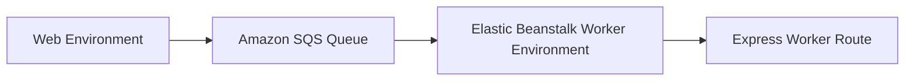

# Build an SQS Worker Environment with Node.js on Elastic Beanstalk

This recipe shows how to run asynchronous background work in a Node.js Elastic Beanstalk worker environment backed by Amazon SQS. It separates queue-driven processing from the web tier so request latency stays predictable.

## Prerequisites

- Running Elastic Beanstalk application.
- Permission to create and use Amazon SQS queues.
- Worker environment available or permission to create one.
- Express application that can handle worker HTTP posts.

## What You'll Build

You will build a worker tier environment that consumes SQS messages and forwards them to an Express handler for processing.



## Steps

### Step 1: Create the queue

```bash
aws sqs create-queue \
    --queue-name "$APP_NAME-worker" \
    --region "$REGION"
```

### Step 2: Create the worker environment

```bash
aws elasticbeanstalk create-environment \
    --application-name "$APP_NAME" \
    --environment-name "$ENV_NAME-worker" \
    --solution-stack-name "64bit Amazon Linux 2023 v6.6.0 running Node.js 20" \
    --tier Name=Worker,Type=SQS/HTTP,Version=\"1.0\" \
    --option-settings Namespace=aws:elasticbeanstalk:sqsd,OptionName=WorkerQueueURL,Value="https://sqs.$REGION.amazonaws.com/<account-id>/$APP_NAME-worker" \
    --region "$REGION"
```

### Step 3: Add an Express worker route

```javascript
const express = require("express");

const app = express();
app.use(express.json());

app.post("/worker", async (req, res) => {
    const job = req.body;
    res.json({ processed: job.jobType });
});
```

### Step 4: Send jobs to the queue

```javascript
const { SendMessageCommand, SQSClient } = require("@aws-sdk/client-sqs");

const client = new SQSClient({ region: process.env.AWS_REGION });

async function enqueueJob(queueUrl, jobType) {
    await client.send(new SendMessageCommand({
        QueueUrl: queueUrl,
        MessageBody: JSON.stringify({ jobType })
    }));
}
```

### Step 5: Deploy and publish a test message

```bash
npm install @aws-sdk/client-sqs
eb deploy --staged

aws sqs send-message \
    --queue-url "https://sqs.$REGION.amazonaws.com/<account-id>/$APP_NAME-worker" \
    --message-body '{"jobType":"thumbnail"}' \
    --region "$REGION"
```

## Verification

```bash
eb logs --all
aws sqs get-queue-attributes \
    --queue-url "https://sqs.$REGION.amazonaws.com/<account-id>/$APP_NAME-worker" \
    --attribute-names ApproximateNumberOfMessages \
    --region "$REGION"
```

Expected result: worker logs confirm the job was processed and the queue depth drains after delivery.

## Clean Up

Terminate the worker environment and delete the queue when testing is complete.

## See Also

- [Node.js Recipes Index](./index.md)
- [Worker Environments Recipe](./worker-environments.md)
- [Operations Section](../../../operations/index.md)

## Sources

- [Elastic Beanstalk Worker Environments](https://docs.aws.amazon.com/elasticbeanstalk/latest/dg/using-features-managing-env-tiers.html)
- [Amazon SQS Developer Guide](https://docs.aws.amazon.com/AWSSimpleQueueService/latest/SQSDeveloperGuide/welcome.html)
- [AWS SDK for JavaScript v3 SQS Examples](https://docs.aws.amazon.com/sdk-for-javascript/v3/developer-guide/javascript_sqs_code_examples.html)
