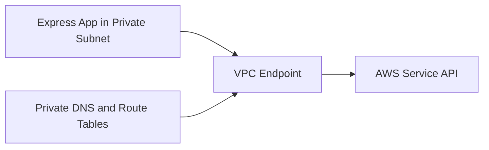

# Use VPC Endpoints with Node.js on Elastic Beanstalk

This recipe shows how to keep AWS service traffic private for a Node.js Elastic Beanstalk environment by using VPC endpoints. It is especially useful for private subnets where direct internet egress is restricted or intentionally removed.

## Prerequisites

- Running Elastic Beanstalk environment in a VPC.
- Identified VPC, subnet, route table, and security group resources.
- Permission to create VPC endpoints.

## What You'll Build

You will build a private Node.js environment that calls AWS service APIs through gateway and interface VPC endpoints.



## Steps

### Step 1: Inspect the existing Elastic Beanstalk VPC resources

```bash
aws elasticbeanstalk describe-environment-resources \
    --environment-name "$ENV_NAME" \
    --region "$REGION"
```

### Step 2: Create a gateway endpoint for Amazon DynamoDB or Amazon S3

```bash
aws ec2 create-vpc-endpoint \
    --vpc-id "$VPC_ID" \
    --service-name "com.amazonaws.$REGION.dynamodb" \
    --vpc-endpoint-type Gateway \
    --route-table-ids "$ROUTE_TABLE_ID" \
    --region "$REGION"
```

### Step 3: Create an interface endpoint for Systems Manager

```bash
aws ec2 create-vpc-endpoint \
    --vpc-id "$VPC_ID" \
    --service-name "com.amazonaws.$REGION.ssm" \
    --vpc-endpoint-type Interface \
    --subnet-ids "$SUBNET_ID" \
    --security-group-ids "$SECURITY_GROUP_ID" \
    --private-dns-enabled \
    --region "$REGION"
```

### Step 4: Keep application code using the normal SDK endpoint

```javascript
const { GetParameterCommand, SSMClient } = require("@aws-sdk/client-ssm");

const client = new SSMClient({ region: process.env.AWS_REGION });

async function readConfig(name) {
    const response = await client.send(
        new GetParameterCommand({ Name: name, WithDecryption: true })
    );
    return response.Parameter.Value;
}
```

### Step 5: Deploy and verify private access

```bash
npm install @aws-sdk/client-ssm
eb deploy --staged
eb logs --all
```

## Verification

```bash
aws ec2 describe-vpc-endpoints \
    --filters Name=vpc-id,Values="$VPC_ID" \
    --region "$REGION"
```

Expected result: the endpoint state is `available` and application logs show successful AWS API calls from the private subnets.

## Clean Up

Delete test VPC endpoints that are no longer required and remove temporary security group rules created for the endpoint network interfaces.

## See Also

- [Node.js Recipes Index](./index.md)
- [Parameter Store Recipe](./parameter-store.md)
- [Secrets Manager Recipe](./secrets-manager.md)

## Sources

- [VPC Endpoints](https://docs.aws.amazon.com/vpc/latest/privatelink/vpc-endpoints.html)
- [Gateway Endpoints](https://docs.aws.amazon.com/vpc/latest/privatelink/gateway-endpoints.html)
- [Interface Endpoints](https://docs.aws.amazon.com/vpc/latest/privatelink/interface-endpoints.html)
