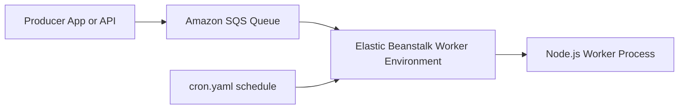

---
hide:
  - toc
---

# Recipe: Worker Environments with Amazon SQS

## Prerequisites

- Elastic Beanstalk application with permission to create worker tier environment.
- Amazon SQS queue available for asynchronous job delivery.
- Node.js code structure that separates web requests from background processing.
- Optional `cron.yaml` requirements for scheduled worker jobs.

## What You'll Build

You will create a worker tier environment that receives messages from Amazon SQS, processes jobs in Node.js, and supports scheduled processing through `cron.yaml` where needed.



## Steps

1. Create or identify an Amazon SQS queue for work items.

2. Create an Elastic Beanstalk worker environment tied to the queue.

3. Implement worker message handling in Node.js application code.

4. Add `cron.yaml` for scheduled tasks when periodic processing is required.

    ```yaml
    version: 1
    cron:
      - name: "daily-job"
        url: "/tasks/daily"
        schedule: "0 2 * * *"
    ```

5. Deploy worker application and submit test SQS messages.

6. Monitor processing success and failures using logs and environment health.

7. Tune queue and worker behavior for throughput goals.

    - Visibility timeout aligned with processing duration.
    - Retry strategy for transient failures.
    - Dead-letter queue routing for poison messages.

8. Keep worker code idempotent for safe retries.

    - Deduplicate by job key when applicable.
    - Avoid non-transactional side effects before commit points.
    - Record processing outcome for auditability.

9. Define operational runbook entries for worker incidents.

    - Backlog growth response.
    - Failed job triage process.
    - Temporary traffic throttling actions.

10. Validate scheduled workloads from `cron.yaml` separately from queue-driven jobs.

## Verification

- Worker environment receives and processes queue messages.
- Failed message handling paths are visible in logs and retriable as designed.
- Scheduled tasks trigger according to `cron.yaml` definitions.
- Web and worker responsibilities are separated across environment tiers.
- Queue timeout and retry parameters are documented for operations.

## See Also

- [First Deployment](../02-first-deploy.md)
- [Logging and Monitoring](../04-logging-monitoring.md)
- [RDS Integration Recipe](./rds-integration.md)

## Sources

- [Managing Elastic Beanstalk environment tiers](https://docs.aws.amazon.com/elasticbeanstalk/latest/dg/using-features-managing-env-tiers.html)
