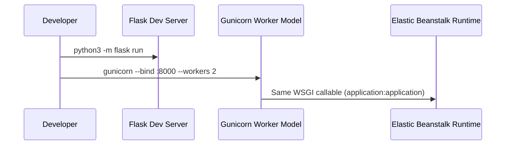

---
hide:
  - toc
---

# Run a Flask App Locally for Elastic Beanstalk

This tutorial prepares a Flask project for AWS Elastic Beanstalk Python by matching local behavior to the documented deployment model.
The target runtime is Flask behind Gunicorn, with `application.py` exporting `application`.

## Prerequisites

- Python 3.11+ installed.
- A clean project folder.
- `pip` available.
- Optional: `venv` module available from your Python installation.

## What You'll Build

You will build a minimal Flask app that:

- Runs with Flask development server for quick iteration.
- Runs with Gunicorn using the same callable format expected by Elastic Beanstalk.
- Includes a `Procfile` aligned with AWS guidance for process startup.

Project target structure:

```text
.
├── application.py
├── requirements.txt
└── Procfile
```

## Steps

1. Create and activate a virtual environment.

```bash
python3 -m venv .venv
source .venv/bin/activate
python3 -m pip install --upgrade pip
```

2. Install Flask and Gunicorn, then freeze dependencies.

```bash
python3 -m pip install Flask gunicorn
python3 -m pip freeze > requirements.txt
```

3. Create `application.py` with the required callable name.

```python
from flask import Flask

application = Flask(__name__)


@application.get("/")
def index():
    return {"message": "ok"}


if __name__ == "__main__":
    application.run(host="0.0.0.0", port=5000, debug=True)
```

4. Create a `Procfile` for Gunicorn startup.

```text
web: gunicorn --bind :8000 --workers 2 application:application
```

5. Run Flask development mode.

```bash
export FLASK_APP=application.py
python3 -m flask run --host 0.0.0.0 --port 5000
```

6. Run Gunicorn for production-parity local testing.

```bash
gunicorn --bind :8000 --workers 2 application:application
```



## Verification

Run these checks before any Elastic Beanstalk deployment:

```bash
python3 -m flask --app application.py routes
gunicorn --check-config --bind :8000 --workers 2 application:application
python3 -m pip show Flask
python3 -m pip show gunicorn
```

Expected results:

- Flask route table includes `/`.
- Gunicorn config validation succeeds.
- Both packages are installed in your virtual environment.
- `application.py` exports `application` exactly.

## See Also

- [First Deploy](./02-first-deploy.md)
- [Python Runtime on AL2023](./python-runtime.md)
- [Platform Overview](../../platform/index.md)

## Sources

- [Deploying a Flask application to Elastic Beanstalk](https://docs.aws.amazon.com/elasticbeanstalk/latest/dg/create-deploy-python-flask.html)
