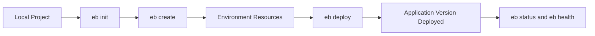

# First Elastic Beanstalk Deploy for Python

This tutorial explains the first deployment workflow for a Python Flask app on AWS Elastic Beanstalk.
It follows the EB CLI sequence documented in AWS getting started guidance.

## Prerequisites

- Completed local app setup from [01-local-run.md](./01-local-run.md).
- AWS CLI and EB CLI installed.
- An initialized AWS profile (`aws configure`) with masked account context.
- Source project includes `application.py`, `requirements.txt`, and optional `Procfile`.

## What You'll Build

You will create:

- An Elastic Beanstalk application definition.
- A web server environment for Python.
- An application version deployed from your source bundle.
- A baseline health and status check routine.

## Steps

1. Initialize EB metadata in your project.

```bash
eb init --platform "Python 3.11 running on 64bit Amazon Linux 2023" --region "$REGION"
```

2. Create an environment (example names only).

```bash
export APP_NAME="eb-python-guide"
export ENV_NAME="eb-python-guide-dev"
export REGION="ap-northeast-2"
eb create "$ENV_NAME" --single
```

3. Deploy current source as a new application version.

```bash
eb deploy "$ENV_NAME" --staged
```

4. Check environment status and health.

```bash
eb status "$ENV_NAME"
eb health "$ENV_NAME"
```

5. Open environment endpoint.

```bash
eb open "$ENV_NAME"
```

Source bundle expectations from AWS docs:

- Application source files are packaged as an application version.
- `.elasticbeanstalk/` stores CLI project configuration.
- `.ebextensions/` and `.platform/` are included when present.



## Verification

Validate deployment without assuming production traffic:

```bash
eb status "$ENV_NAME"
eb events "$ENV_NAME" --follow
aws elasticbeanstalk describe-environments --application-name "$APP_NAME" --region "$REGION"
```

Expected checks:

- Environment shows `Ready` and health `Green` after successful deploy.
- Event stream shows successful application version deployment.
- Environment URL returns your Flask response.

If health is not green, inspect logs in the next tutorial.

## See Also

- [Configuration Basics](./03-configuration.md)
- [Logging and Monitoring](./04-logging-monitoring.md)
- [Local Run](./01-local-run.md)

## Sources

- [Getting started tutorial for Elastic Beanstalk](https://docs.aws.amazon.com/elasticbeanstalk/latest/dg/GettingStarted.CreateApp.html)
