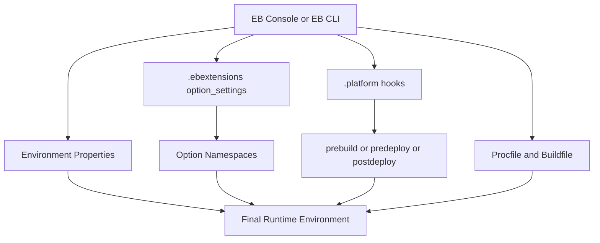

# Configure Python Environments on Elastic Beanstalk

This tutorial covers the configuration layers used by AWS Elastic Beanstalk for Python applications.
It combines environment properties, `.ebextensions`, platform hooks, and process files.

## Prerequisites

- Existing Elastic Beanstalk Python environment.
- Access to application source repository.
- Familiarity with YAML syntax for `.config` files.

## What You'll Build

You will define a configuration model with:

- Environment properties for runtime configuration.
- `.ebextensions/*.config` for option settings and resource customization.
- `.platform/hooks/` scripts for platform lifecycle actions.
- `Procfile` and optional `Buildfile` for process behavior.

## Steps

1. Set environment properties with EB CLI.

```bash
eb setenv FLASK_ENV=production APP_MODE=guide LOG_LEVEL=INFO
eb printenv
```

2. Add `.ebextensions/01-options.config` for option namespaces.

```yaml
option_settings:
    aws:elasticbeanstalk:application:environment:
        FLASK_ENV: production
        APP_MODE: guide
    aws:elasticbeanstalk:container:python:
        WSGIPath: application.py
```

3. Add `.ebextensions/02-proxy.config` for load balancer or proxy options when needed.

```yaml
option_settings:
    aws:elbv2:listener:default:
        Protocol: HTTP
```

4. Add platform hook script at `.platform/hooks/predeploy/10-print-env.sh`.

```bash
#!/usr/bin/env bash
set -o errexit
set -o nounset
set -o pipefail
env | sort > /var/app/staging/runtime-env-snapshot.txt
```

5. Ensure executable permissions before packaging.

```bash
chmod +x .platform/hooks/predeploy/10-print-env.sh
```

6. Keep `Procfile` explicit for Gunicorn command control.

```text
web: gunicorn --bind :8000 --workers 2 application:application
```



## Verification

Run a deploy and validate config application:

```bash
eb deploy --staged
eb logs --all
eb printenv
```

Expected checks:

- Environment variables are visible via `eb printenv`.
- Hook-generated file appears in deployment logs or instance filesystem.
- Option settings are reflected in environment configuration.

When diagnosing precedence, compare console settings with committed `.ebextensions` files.

## See Also

- [First Deploy](./02-first-deploy.md)
- [Python Runtime Details](./python-runtime.md)
- [Custom Platform Hooks Recipe](./recipes/custom-platform-hooks.md)

## Sources

- [Advanced environment customization with .ebextensions](https://docs.aws.amazon.com/elasticbeanstalk/latest/dg/ebextensions.html)
