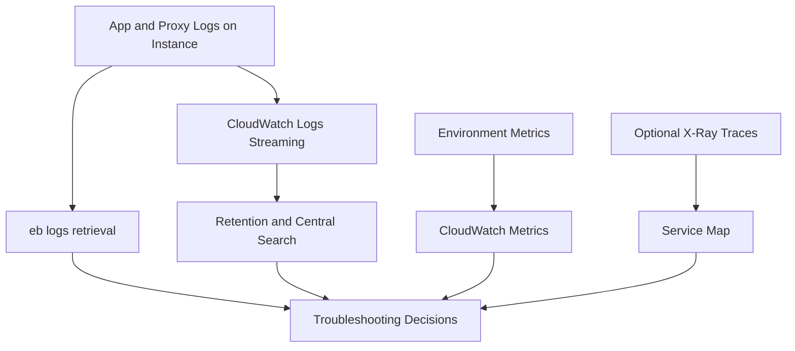

# Logging and Monitoring for Python Environments

This tutorial maps AWS Elastic Beanstalk logging and monitoring features for Python workloads.
It focuses on log retrieval, CloudWatch log streaming, metrics, and optional X-Ray integration paths.

## Prerequisites

- A running Elastic Beanstalk Python environment.
- IAM permissions for CloudWatch Logs and Elastic Beanstalk APIs.
- EB CLI installed for log retrieval operations.

## What You'll Build

You will build an observation baseline that includes:

- Instance log access for deployment and application diagnostics.
- Request logs and full logs retrieval through EB CLI.
- CloudWatch Logs streaming for centralized retention.
- Metric and trace visibility aligned with AWS-managed integrations.

## Steps

1. Retrieve recent logs and full logs from the environment.

```bash
eb logs --zip
eb logs --all
```

2. Review key files referenced in AWS documentation:

- `/var/log/web.stdout.log`
- `/var/log/web.error.log`
- `/var/log/eb-engine.log`
- `/var/log/nginx/access.log`
- `/var/log/nginx/error.log`

3. Enable CloudWatch log streaming from configuration.

```yaml
option_settings:
    aws:elasticbeanstalk:cloudwatch:logs:
        StreamLogs: true
        DeleteOnTerminate: false
        RetentionInDays: 14
```

4. Deploy and verify CloudWatch log groups.

```bash
eb deploy --staged
aws logs describe-log-groups --log-group-name-prefix "/aws/elasticbeanstalk/" --region "$REGION"
```

5. Check environment health and metrics trend.

```bash
eb health
aws cloudwatch get-metric-statistics --namespace "AWS/ElasticBeanstalk" --metric-name "EnvironmentHealth" --start-time "2026-01-01T00:00:00Z" --end-time "2026-01-01T01:00:00Z" --period 60 --statistics Average --region "$REGION"
```

6. If your environment uses X-Ray integration, verify daemon or platform support per AWS docs.



## Verification

Use repeatable checks after each deployment:

```bash
eb events --follow
eb logs --all
aws logs describe-log-streams --log-group-name "/aws/elasticbeanstalk/$ENV_NAME/var/log/web.stdout.log" --region "$REGION"
```

Expected outcomes:

- `eb-engine.log` confirms deployment phases.
- Application stdout and error logs are populated.
- CloudWatch log streams appear after environment update.
- Health transitions and metrics correlate with request behavior.

## See Also

- [Configuration](./03-configuration.md)
- [Infrastructure as Code](./05-infrastructure-as-code.md)
- [Troubleshooting Hub](../../troubleshooting/index.md)

## Sources

- [Streaming Elastic Beanstalk logs to CloudWatch Logs](https://docs.aws.amazon.com/elasticbeanstalk/latest/dg/AWSHowTo.cloudwatchlogs.html)
