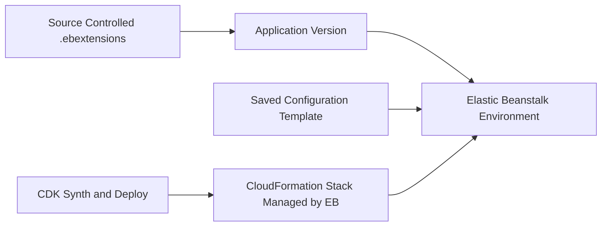

---
hide:
  - toc
---

# Infrastructure as Code for Python Environments

This tutorial explains infrastructure-as-code approaches for AWS Elastic Beanstalk Python environments.
It aligns with AWS guidance for saved configurations, CloudFormation-backed resources, and repeatable environment definitions.

## Prerequisites

- Existing Elastic Beanstalk application and environment.
- AWS CLI access for Elastic Beanstalk and CloudFormation APIs.
- A repository workflow that can version configuration artifacts.

## What You'll Build

You will build reusable infrastructure definitions using:

- Elastic Beanstalk saved configurations.
- `.ebextensions` resources and option settings.
- CloudFormation resource awareness for generated stacks.
- A CDK-style deployment wrapper pattern that references EB constructs.

## Steps

1. Save current environment configuration as a named template.

```bash
aws elasticbeanstalk create-configuration-template --application-name "$APP_NAME" --template-name "python-baseline" --environment-id "$ENV_ID" --region "$REGION"
```

2. Export or inspect saved configurations for reuse.

```bash
aws elasticbeanstalk describe-configuration-settings --application-name "$APP_NAME" --template-name "python-baseline" --region "$REGION"
```

3. Add `.ebextensions/03-resources.config` for additional AWS resources.

```yaml
Resources:
    AppBucket:
        Type: AWS::S3::Bucket
        Properties:
            BucketEncryption:
                ServerSideEncryptionConfiguration:
                    - ServerSideEncryptionByDefault:
                          SSEAlgorithm: AES256
```

4. Keep option settings in source control.

```yaml
option_settings:
    aws:elasticbeanstalk:application:environment:
        APP_MODE: iac
    aws:autoscaling:asg:
        MinSize: 1
        MaxSize: 2
```

5. Recreate a new environment from saved template when needed.

```bash
aws elasticbeanstalk create-environment --application-name "$APP_NAME" --environment-name "$ENV_NAME" --template-name "python-baseline" --solution-stack-name "64bit Amazon Linux 2023 v4.3.0 running Python 3.11" --region "$REGION"
```

6. For CDK workflows, keep Elastic Beanstalk app/environment resources parameterized and point to versioned source bundles in S3.



## Verification

Confirm IaC artifacts are usable and reproducible:

```bash
aws elasticbeanstalk describe-configuration-templates --application-name "$APP_NAME" --region "$REGION"
aws elasticbeanstalk describe-environment-resources --environment-name "$ENV_NAME" --region "$REGION"
```

Expected checks:

- Saved configuration template appears in the application.
- Environment resources can be described consistently.
- Recreated environment uses the same baseline options.

## See Also

- [Configuration](./03-configuration.md)
- [CI/CD](./06-ci-cd.md)
- [Saved Configurations and Templates](../../reference/index.md)

## Sources

- [Saved configurations in Elastic Beanstalk](https://docs.aws.amazon.com/elasticbeanstalk/latest/dg/environment-configuration-savedconfig.html)
