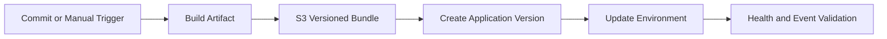

# CI/CD for Python on Elastic Beanstalk

This tutorial shows how to automate deployments by promoting Elastic Beanstalk application versions through pipeline stages.
It covers AWS-native pipeline components and a GitHub Actions packaging pattern.

## Prerequisites

- Existing Elastic Beanstalk application and environment.
- Source bundle process that produces deterministic zip artifacts.
- Access to CodePipeline, CodeBuild, and S3 in your AWS account.

## What You'll Build

You will build a release process that:

- Packages source into a versioned bundle.
- Registers or deploys a specific application version.
- Uses pipeline stages for source, build, and deploy.
- Supports optional GitHub Actions automation while keeping AWS deployment API as source of truth.

## Steps

1. Define a version label format that is unique and traceable.

```bash
export VERSION_LABEL="python-$(date +%Y%m%d%H%M%S)"
```

2. Build source artifact and upload to S3.

```bash
zip -r "$VERSION_LABEL.zip" . -x ".git/*" ".venv/*"
aws s3 cp "$VERSION_LABEL.zip" "s3://$ARTIFACT_BUCKET/$VERSION_LABEL.zip" --region "$REGION"
```

3. Create an Elastic Beanstalk application version.

```bash
aws elasticbeanstalk create-application-version --application-name "$APP_NAME" --version-label "$VERSION_LABEL" --source-bundle S3Bucket="$ARTIFACT_BUCKET",S3Key="$VERSION_LABEL.zip" --region "$REGION"
```

4. Deploy that exact version to the environment.

```bash
aws elasticbeanstalk update-environment --environment-name "$ENV_NAME" --version-label "$VERSION_LABEL" --region "$REGION"
```

5. In CodePipeline, connect stages:

- Source stage (repository or artifact feed).
- Build stage (CodeBuild package and validate).
- Deploy stage (Elastic Beanstalk deploy action).

6. Optional GitHub Actions workflow can call AWS CLI with long flags and OIDC role assumption.

```yaml
name: deploy-eb-python
on:
    workflow_dispatch:
jobs:
    deploy:
        runs-on: ubuntu-latest
        steps:
            - uses: actions/checkout@v4
            - name: Configure AWS credentials
              uses: aws-actions/configure-aws-credentials@v4
              with:
                  role-to-assume: arn:aws:iam::<account-id>:role/github-actions-eb
                  aws-region: ap-northeast-2
            - name: Build source bundle
              run: zip -r bundle.zip . -x ".git/*" ".venv/*"
```



## Verification

Use AWS APIs to verify exact version promotion:

```bash
aws elasticbeanstalk describe-application-versions --application-name "$APP_NAME" --version-labels "$VERSION_LABEL" --region "$REGION"
aws elasticbeanstalk describe-environments --application-name "$APP_NAME" --region "$REGION"
eb events "$ENV_NAME"
```

Expected checks:

- Version label exists and points to the intended source bundle.
- Environment reports the same deployed version label.
- Event stream confirms successful deployment lifecycle.

## See Also

- [Infrastructure as Code](./05-infrastructure-as-code.md)
- [First Deploy](./02-first-deploy.md)

## Sources

- [Deploying an existing application version](https://docs.aws.amazon.com/elasticbeanstalk/latest/dg/using-features.deploy-existing-version.html)
