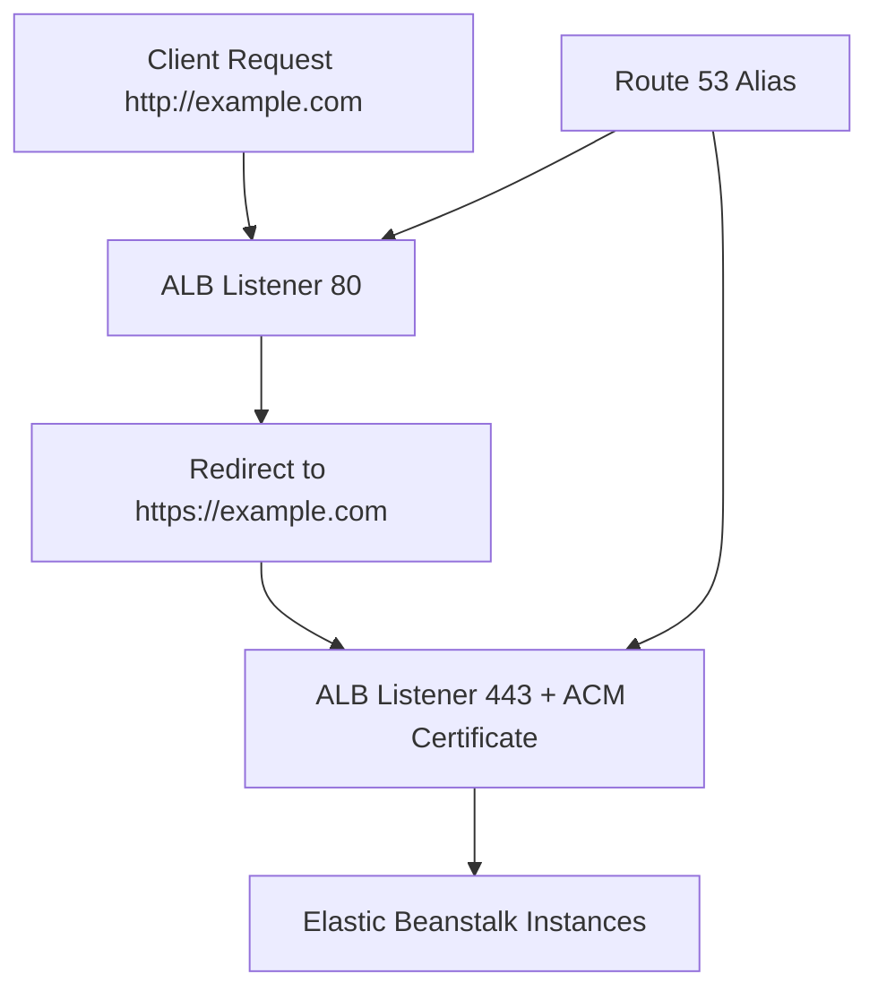

# Configure Custom Domain and HTTPS

This tutorial configures HTTPS for an Elastic Beanstalk Python environment using AWS Certificate Manager and load balancer listeners.
It also covers Route 53 alias records and HTTP-to-HTTPS redirection patterns.

## Prerequisites

- Running Elastic Beanstalk environment using an Application Load Balancer.
- Domain hosted in Route 53 or delegated DNS control.
- ACM certificate in the same region as the load balancer.

## What You'll Build

You will build an HTTPS entry path that includes:

- Custom domain record pointing at the Elastic Beanstalk load balancer.
- TLS certificate attached to HTTPS listener.
- HTTP listener redirecting to HTTPS.
- Optional backend encryption strategy depending on architecture.

## Steps

1. Request or import an ACM certificate.

```bash
aws acm request-certificate --domain-name "example.com" --subject-alternative-names "www.example.com" --validation-method DNS --region "$REGION"
```

2. Identify the load balancer associated with your environment.

```bash
aws elasticbeanstalk describe-environment-resources --environment-name "$ENV_NAME" --region "$REGION"
```

3. Configure HTTPS listener on port 443 with ACM certificate.

```yaml
option_settings:
    aws:elbv2:listener:443:
        ListenerEnabled: true
        Protocol: HTTPS
        SSLCertificateArns: arn:aws:acm:ap-northeast-2:<account-id>:certificate/xxxxxxxx-xxxx-xxxx-xxxx-xxxxxxxxxxxx
```

4. Configure HTTP listener redirect behavior.

```yaml
option_settings:
    aws:elbv2:listener:80:
        ListenerEnabled: true
        Rules: default
```

5. Add Route 53 alias A/AAAA records to the load balancer DNS name.

6. Deploy updated configuration.

```bash
eb deploy --staged
eb status "$ENV_NAME"
```



## Verification

Validate DNS and TLS settings:

```bash
aws route53 list-resource-record-sets --hosted-zone-id "$HOSTED_ZONE_ID"
aws elbv2 describe-listeners --load-balancer-arn "$LOAD_BALANCER_ARN" --region "$REGION"
curl --verbose "https://example.com"
```

Expected checks:

- Alias record resolves to the environment load balancer.
- Listener `443` uses the intended ACM certificate ARN (masked account ID).
- HTTP requests redirect to HTTPS.
- HTTPS endpoint returns the Flask application response.

## See Also

- [CI/CD](./06-ci-cd.md)
- [Configuration](./03-configuration.md)
- [Platform Networking](../../platform/index.md)

## Sources

- [Configuring HTTPS for your Elastic Beanstalk environment](https://docs.aws.amazon.com/elasticbeanstalk/latest/dg/configuring-https.html)
