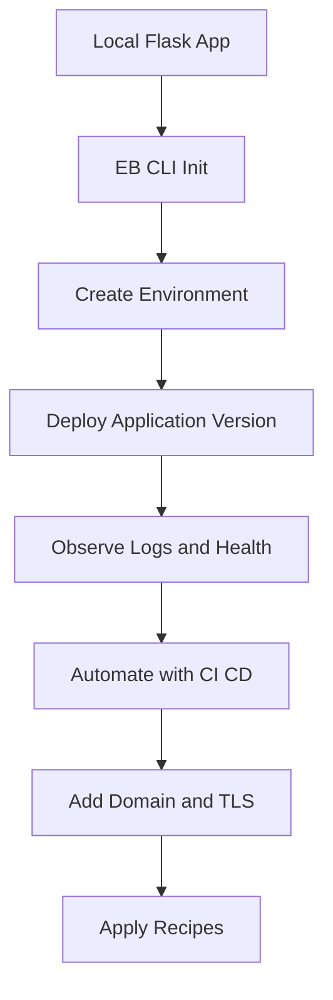

---
hide:
  - toc
---

# Python on AWS Elastic Beanstalk

This track focuses on AWS Elastic Beanstalk Python on Amazon Linux 2023 using Flask and Gunicorn.
It follows the Elastic Beanstalk workflow from local development to deployment, operations, and production-ready extensions.

## Prerequisites

- Python 3.11 or later installed locally.
- AWS CLI v2 configured with a profile and default region.
- EB CLI installed (`pip install awsebcli` or your preferred package workflow).
- IAM permissions to create and inspect Elastic Beanstalk application resources.
- A test AWS account context with masked identifiers in shared examples.

```bash
python3 --version
aws --version
eb --version
aws sts get-caller-identity
```

## What You'll Build

You will build a Flask application that:

- Exposes an `application` callable in `application.py` for Elastic Beanstalk.
- Runs locally with Flask dev server and Gunicorn for runtime parity.
- Deploys to an Elastic Beanstalk web server environment.
- Uses environment configuration, logging, and monitoring features from AWS docs.

## Steps

| Step | File | Focus |
|---|---|---|
| 1 | [01-local-run.md](./01-local-run.md) | Local Flask and Gunicorn execution |
| 2 | [02-first-deploy.md](./02-first-deploy.md) | First Elastic Beanstalk deployment flow |
| 3 | [03-configuration.md](./03-configuration.md) | Environment properties and configuration files |
| 4 | [04-logging-monitoring.md](./04-logging-monitoring.md) | Logs, CloudWatch, metrics, and tracing |
| 5 | [05-infrastructure-as-code.md](./05-infrastructure-as-code.md) | IaC options for environment definition |
| 6 | [06-ci-cd.md](./06-ci-cd.md) | Deployment automation with pipeline patterns |
| 7 | [07-custom-domain-ssl.md](./07-custom-domain-ssl.md) | Domain and HTTPS setup on load balancers |
| 8 | [python-runtime.md](./python-runtime.md) | Python platform runtime details on AL2023 |
| 9 | [recipes/index.md](./recipes/index.md) | Integration recipes for common workloads |



## Verification

Use these checks to confirm your workstation and guide entry point are ready:

```bash
python3 --version
aws configure list
eb --version
aws elasticbeanstalk list-available-solution-stacks
```

Expected outcomes:

- Python 3.11+ is available.
- AWS CLI shows configured credentials and region (masked in outputs).
- EB CLI is installed and returns a version.
- Elastic Beanstalk API calls succeed for your account context.

## See Also

- [Language Guides Index](../index.md)
- [Platform Overview](../../platform/index.md)
- [How Elastic Beanstalk Works](../../platform/how-elastic-beanstalk-works.md)
- [Python Recipes](./recipes/index.md)

## Sources

- [AWS Elastic Beanstalk Developer Guide](https://docs.aws.amazon.com/elasticbeanstalk/latest/dg/Welcome.html)
- [Python Platform on Elastic Beanstalk](https://docs.aws.amazon.com/elasticbeanstalk/latest/dg/python-platform.html)
