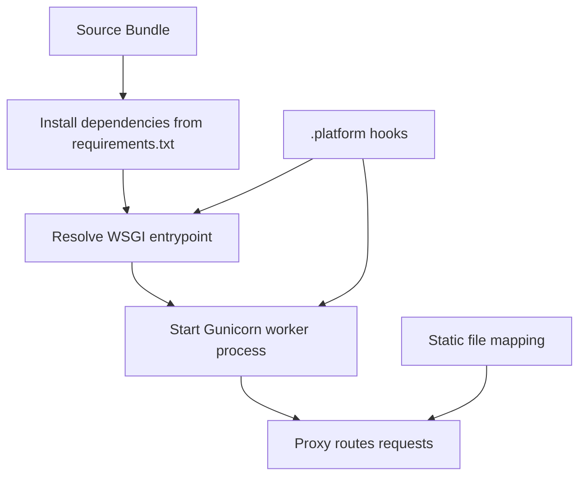

---
hide:
  - toc
---

# Python Runtime on Amazon Linux 2023

This tutorial describes runtime behavior for AWS Elastic Beanstalk Python on Amazon Linux 2023.
It focuses on version selection, WSGI and Gunicorn behavior, dependency installation, and platform extension points.

## Prerequisites

- A Python Elastic Beanstalk environment using Amazon Linux 2023.
- Access to application source (`application.py`, `requirements.txt`, optional `Procfile`).
- Familiarity with environment configuration and deployment lifecycle.

## What You'll Build

You will establish a runtime baseline that includes:

- Explicit Python platform branch selection.
- Deterministic dependency install via `requirements.txt`.
- Gunicorn startup through default behavior or `Procfile` override.
- Static file mapping and platform hook customization.

## Steps

1. Select Python platform version compatible with your app.

```bash
aws elasticbeanstalk list-platform-versions --filters "Type=PlatformName,Operator==,Values=Python" --region "$REGION"
```

2. Keep `requirements.txt` in project root for package install during deployment.

```text
Flask==3.0.0
gunicorn==21.2.0
```

3. Expose WSGI callable in `application.py`.

```python
from flask import Flask

application = Flask(__name__)


@application.get("/")
def health():
    return "ok"
```

4. Use `Procfile` when you need explicit Gunicorn configuration.

```text
web: gunicorn --bind :8000 --workers 2 application:application
```

5. Configure static files mapping if serving static assets through proxy integration.

```yaml
option_settings:
    aws:elasticbeanstalk:environment:proxy:staticfiles:
        /static: static
```

6. Add lifecycle scripts in `.platform/hooks/` for custom actions.

```text
.platform/hooks/prebuild/
.platform/hooks/predeploy/
.platform/hooks/postdeploy/
```

7. Deploy and inspect runtime logs to confirm behavior.

```bash
eb deploy --staged
eb logs --all
```



## Verification

Use these checks to validate runtime assumptions:

```bash
eb status "$ENV_NAME"
eb logs --all
aws elasticbeanstalk describe-configuration-settings --application-name "$APP_NAME" --environment-name "$ENV_NAME" --region "$REGION"
```

Expected outcomes:

- Platform branch shows Amazon Linux 2023 Python.
- Deployment installs dependencies from `requirements.txt`.
- Gunicorn process binds to expected port through `Procfile` or platform default.
- Hook scripts execute in the expected lifecycle order.

## See Also

- [Local Run](./01-local-run.md)
- [Configuration](./03-configuration.md)
- [Custom Platform Hooks Recipe](./recipes/custom-platform-hooks.md)

## Sources

- [Python platform branch on Amazon Linux 2/2023](https://docs.aws.amazon.com/elasticbeanstalk/latest/dg/python-platform-al2.html)
