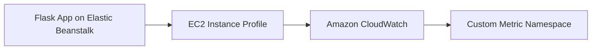

# Publish Custom CloudWatch Metrics from Python on Elastic Beanstalk

This recipe shows how to publish application-specific metrics from Flask to Amazon CloudWatch. It helps you monitor business events or internal workload signals that Elastic Beanstalk health metrics do not expose.

## Prerequisites

- Running Python Elastic Beanstalk environment.
- IAM permission for `cloudwatch:PutMetricData`.
- CloudWatch monitoring and alerting workflow defined for the metric.

## What You'll Build

You will build a Flask endpoint that publishes a custom metric to CloudWatch whenever the application processes a tracked action.



## Steps

### Step 1: Grant the instance profile permission to publish metrics

```json
{
    "Version": "2012-10-17",
    "Statement": [
        {
            "Effect": "Allow",
            "Action": "cloudwatch:PutMetricData",
            "Resource": "*"
        }
    ]
}
```

### Step 2: Define a metric namespace in environment properties

```bash
aws elasticbeanstalk update-environment \
    --application-name "$APP_NAME" \
    --environment-name "$ENV_NAME" \
    --option-settings Namespace=aws:elasticbeanstalk:application:environment,OptionName=CW_NAMESPACE,Value="$APP_NAME/Application" \
    --region "$REGION"
```

### Step 3: Publish metrics from Flask with boto3

```python
import os

import boto3
from flask import Flask

application = Flask(__name__)
cloudwatch = boto3.client("cloudwatch")


@application.post("/orders")
def create_order():
    cloudwatch.put_metric_data(
        Namespace=os.environ["CW_NAMESPACE"],
        MetricData=[
            {
                "MetricName": "OrdersCreated",
                "Unit": "Count",
                "Value": 1,
                "Dimensions": [
                    {"Name": "EnvironmentName", "Value": os.environ["ENV_NAME"]}
                ]
            }
        ]
    )
    return {"status": "metric-published"}, 202
```

### Step 4: Expose the environment name to the application

```bash
aws elasticbeanstalk update-environment \
    --application-name "$APP_NAME" \
    --environment-name "$ENV_NAME" \
    --option-settings Namespace=aws:elasticbeanstalk:application:environment,OptionName=ENV_NAME,Value="$ENV_NAME" \
    --region "$REGION"
```

### Step 5: Deploy and exercise the metric path

```bash
eb deploy --staged
curl --request POST "http://$CNAME/orders"
```

## Verification

```bash
aws cloudwatch list-metrics \
    --namespace "$APP_NAME/Application" \
    --region "$REGION"
```

Expected result: CloudWatch lists the `OrdersCreated` metric after the application route is invoked.

## Clean Up

Remove the code path or metric publishing policy if you no longer need the metric. Custom metrics age out automatically when no new data points are published.

## See Also

- [Python Recipes Index](./index.md)
- [IAM Instance Profile Recipe](./iam-instance-profile.md)
- [Operations Section](../../../operations/index.md)

## Sources

- [Publishing Metrics in Amazon CloudWatch](https://docs.aws.amazon.com/AmazonCloudWatch/latest/monitoring/publishingMetrics.html)
- [Boto3 CloudWatch Client](https://boto3.amazonaws.com/v1/documentation/api/latest/reference/services/cloudwatch.html)
- [Elastic Beanstalk Health and Monitoring](https://docs.aws.amazon.com/elasticbeanstalk/latest/dg/health-enhanced.html)
