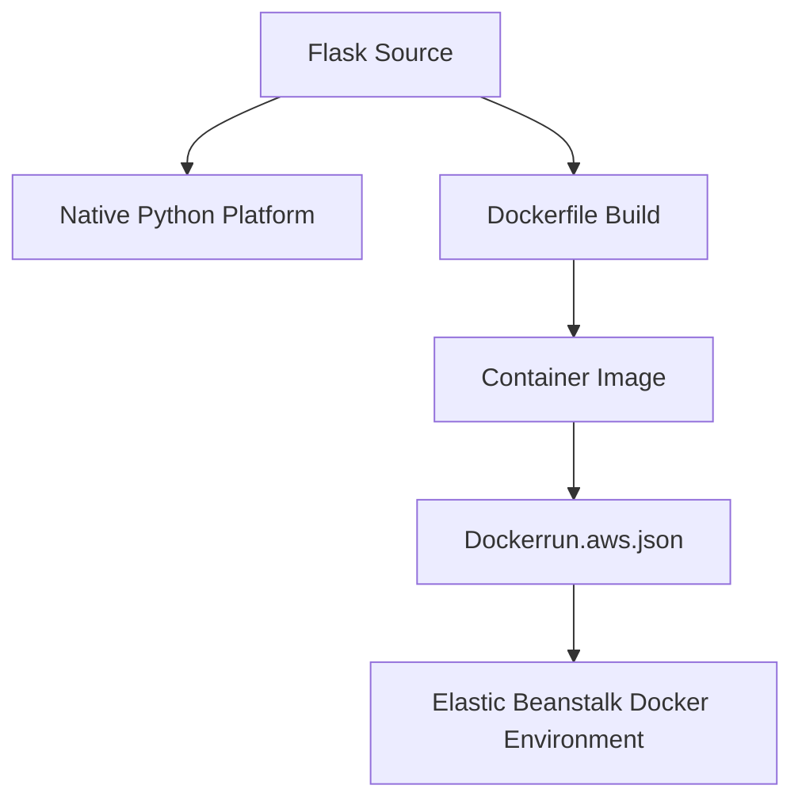

# Deploy Flask with Docker on Elastic Beanstalk

This tutorial shows the Docker deployment path for a Flask application on Elastic Beanstalk.
It compares native Python platform usage with single-container Docker options.

## Prerequisites

- Docker installed locally.
- Existing Flask app with `application.py`.
- Elastic Beanstalk application ready for Docker platform branch.

## What You'll Build

You will build:

- A Docker image for Flask + Gunicorn.
- `Dockerrun.aws.json` metadata for single-container deployment.
- Decision criteria for Docker versus native Python platform.

## Steps

1. Create `Dockerfile` for Flask runtime.

```dockerfile
FROM public.ecr.aws/docker/library/python:3.11-slim

WORKDIR /app
COPY requirements.txt requirements.txt
RUN pip install --no-cache-dir -r requirements.txt
COPY . .
EXPOSE 8000
CMD ["gunicorn", "--bind", ":8000", "--workers", "2", "application:application"]
```

2. Build local image for validation.

```bash
docker build --tag flask-eb:latest .
docker run --rm --publish 8000:8000 flask-eb:latest
```

3. Add `Dockerrun.aws.json` for Elastic Beanstalk single container deployment.

```json
{
    "AWSEBDockerrunVersion": "1",
    "Image": {
        "Name": "<account-id>.dkr.ecr.ap-northeast-2.amazonaws.com/flask-eb:latest",
        "Update": "true"
    },
    "Ports": [
        {
            "ContainerPort": "8000"
        }
    ]
}
```

4. Initialize Elastic Beanstalk for Docker platform if creating separate environment.

```bash
eb init --platform "Docker running on 64bit Amazon Linux 2023" --region "$REGION"
```

5. Deploy Docker bundle.

```bash
eb deploy --staged
```

6. Choose runtime mode based on AWS-documented tradeoffs:

- Native Python platform for direct language-platform features.
- Docker when you need container-level dependency and runtime control.



## Verification

Validate container deployment behavior:

```bash
eb status "$ENV_NAME"
eb logs --all
curl --verbose "http://$CNAME"
```

Expected outcomes:

- Environment health becomes green after deployment.
- Logs show container startup and Gunicorn bind on port `8000`.
- Root endpoint responds from containerized Flask app.

## See Also

- [Python Runtime](../python-runtime.md)
- [CI/CD](../06-ci-cd.md)
- [Local Run](../01-local-run.md)

## Sources

- [Single container Docker environments](https://docs.aws.amazon.com/elasticbeanstalk/latest/dg/single-container-docker.html)
