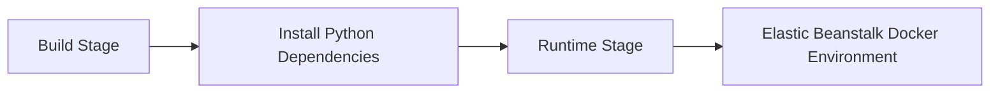

# Use Docker Multi-Stage Builds for Python on Elastic Beanstalk

This recipe shows how to package a Python application with a multi-stage Docker build for Elastic Beanstalk. It reduces final image size and keeps build-only tooling out of the runtime image.

## Prerequisites

- Docker-based Elastic Beanstalk environment.
- Python application that can run behind Gunicorn.
- Docker installed locally for image validation.

## What You'll Build

You will build a Docker image that compiles dependencies in one stage and copies only the runtime artifacts into a smaller final image used by Elastic Beanstalk.



## Steps

### Step 1: Create a multi-stage Dockerfile

```dockerfile
FROM public.ecr.aws/docker/library/python:3.11-slim AS build

WORKDIR /app
COPY requirements.txt .
RUN python -m venv /opt/venv && \
    /opt/venv/bin/pip install --upgrade pip && \
    /opt/venv/bin/pip install --no-cache-dir -r requirements.txt

FROM public.ecr.aws/docker/library/python:3.11-slim

ENV PATH="/opt/venv/bin:$PATH"
WORKDIR /app
COPY --from=build /opt/venv /opt/venv
COPY . .
CMD ["gunicorn", "application:application", "--bind", "0.0.0.0:8080"]
```

### Step 2: Add a `.dockerignore` file

```text
.git
.venv
__pycache__
*.pyc
docs
```

### Step 3: Build the image locally

```bash
docker build --tag "$APP_NAME:local" .
```

### Step 4: Run the image and confirm the port mapping

```bash
docker run --rm --publish 8080:8080 "$APP_NAME:local"
```

### Step 5: Deploy to Elastic Beanstalk

```bash
eb deploy --staged
```

## Verification

```bash
docker images "$APP_NAME:local"
curl --verbose "http://127.0.0.1:8080/"
eb health --refresh
```

Expected result: the local image starts successfully and the Elastic Beanstalk environment returns healthy after deployment.

## Clean Up

```bash
docker image rm "$APP_NAME:local"
```

Also remove any unused Docker platform environments if this recipe was only for testing.

## See Also

- [Python Recipes Index](./index.md)
- [Docker Deploy Recipe](./docker-deploy.md)
- [Python Runtime](../python-runtime.md)

## Sources

- [Elastic Beanstalk Docker Platform](https://docs.aws.amazon.com/elasticbeanstalk/latest/dg/create_deploy_docker.html)
- [Dockerfile Reference](https://docs.docker.com/reference/dockerfile/)
- [Deploying a Python Application with Elastic Beanstalk](https://docs.aws.amazon.com/elasticbeanstalk/latest/dg/create-deploy-python-container.html)
