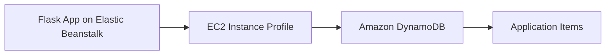

# Use Amazon DynamoDB with Python on Elastic Beanstalk

This recipe shows how to connect a Flask application to Amazon DynamoDB by using `boto3` and an Elastic Beanstalk instance profile. It fits request-driven lookups, metadata storage, and simple key-value access patterns.

## Prerequisites

- Running Python Elastic Beanstalk environment.
- IAM permission for `dynamodb:GetItem`, `dynamodb:PutItem`, and `dynamodb:DescribeTable`.
- Existing DynamoDB table or permission to create one.

## What You'll Build

You will build a small API that writes and reads items from a DynamoDB table from a Python Elastic Beanstalk environment.



## Steps

### Step 1: Create a DynamoDB table

```bash
aws dynamodb create-table \
    --table-name "$APP_NAME-items" \
    --attribute-definitions AttributeName=item_id,AttributeType=S \
    --key-schema AttributeName=item_id,KeyType=HASH \
    --billing-mode PAY_PER_REQUEST \
    --region "$REGION"
```

### Step 2: Add the table name as an environment property

```bash
aws elasticbeanstalk update-environment \
    --application-name "$APP_NAME" \
    --environment-name "$ENV_NAME" \
    --option-settings Namespace=aws:elasticbeanstalk:application:environment,OptionName=DDB_TABLE_NAME,Value="$APP_NAME-items" \
    --region "$REGION"
```

### Step 3: Grant the instance profile table access

```json
{
    "Version": "2012-10-17",
    "Statement": [
        {
            "Effect": "Allow",
            "Action": [
                "dynamodb:DescribeTable",
                "dynamodb:GetItem",
                "dynamodb:PutItem"
            ],
            "Resource": "arn:aws:dynamodb:$REGION:<account-id>:table/$APP_NAME-items"
        }
    ]
}
```

### Step 4: Read and write items with boto3

```python
import os

import boto3
from flask import Flask, request

application = Flask(__name__)
table = boto3.resource("dynamodb").Table(os.environ["DDB_TABLE_NAME"])


@application.post("/items")
def create_item():
    payload = request.get_json()
    table.put_item(Item={"item_id": payload["item_id"], "value": payload["value"]})
    return {"status": "stored"}, 201


@application.get("/items/<item_id>")
def get_item(item_id: str):
    response = table.get_item(Key={"item_id": item_id})
    return response.get("Item", {})
```

### Step 5: Deploy the updated app

```bash
eb deploy --staged
```

## Verification

```bash
curl --request POST \
    --header "Content-Type: application/json" \
    --data '{"item_id":"sample-1","value":"hello"}' \
    "http://$CNAME/items"

curl --verbose "http://$CNAME/items/sample-1"
```

Expected result: the first request stores an item and the second request returns it from DynamoDB.

## Clean Up

```bash
aws dynamodb delete-table \
    --table-name "$APP_NAME-items" \
    --region "$REGION"
```

Also remove the `DDB_TABLE_NAME` environment property and the IAM policy statement if this recipe was for testing only.

## See Also

- [Python Recipes Index](./index.md)
- [IAM Instance Profile Recipe](./iam-instance-profile.md)
- [Python Runtime](../python-runtime.md)

## Sources

- [Amazon DynamoDB Developer Guide](https://docs.aws.amazon.com/amazondynamodb/latest/developerguide/Introduction.html)
- [Boto3 DynamoDB Service Resource](https://boto3.amazonaws.com/v1/documentation/api/latest/guide/dynamodb.html)
- [Elastic Beanstalk Environment Properties](https://docs.aws.amazon.com/elasticbeanstalk/latest/dg/environments-cfg-softwaresettings.html)
