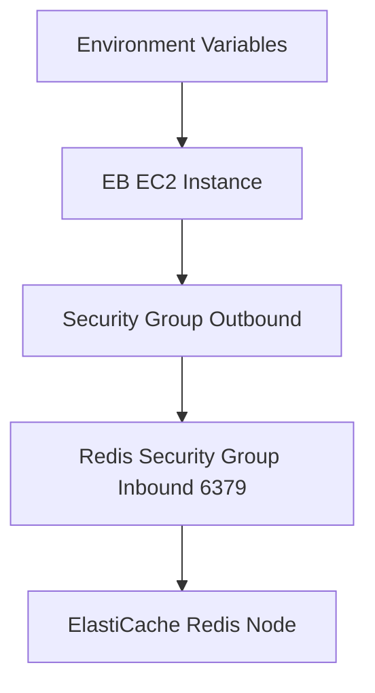

---
hide:
  - toc
---

# Add ElastiCache Redis to a Python Environment

This tutorial connects a Python Flask application on Elastic Beanstalk to Amazon ElastiCache for Redis.
It follows AWS guidance for VPC placement and security group connectivity.

## Prerequisites

- Elastic Beanstalk environment in a VPC.
- ElastiCache Redis cluster in reachable subnets.
- Security groups configured for Redis port `6379` access.
- Python dependencies for Redis client usage.

## What You'll Build

You will build:

- Environment properties containing Redis endpoint details.
- Flask caching integration using Redis backend.
- Runtime checks for cache read/write behavior.

## Steps

1. Set Redis connection properties in environment.

```bash
eb setenv REDIS_HOST="mycache.xxxxxx.0001.apn2.cache.amazonaws.com" REDIS_PORT="6379" REDIS_DB="0"
```

2. Install cache dependencies.

```bash
python3 -m pip install redis Flask-Caching
python3 -m pip freeze > requirements.txt
```

3. Configure Flask-Caching.

```python
import os
from flask import Flask
from flask_caching import Cache

application = Flask(__name__)
application.config["CACHE_TYPE"] = "RedisCache"
application.config["CACHE_REDIS_HOST"] = os.environ["REDIS_HOST"]
application.config["CACHE_REDIS_PORT"] = int(os.environ.get("REDIS_PORT", "6379"))
application.config["CACHE_REDIS_DB"] = int(os.environ.get("REDIS_DB", "0"))
cache = Cache(application)


@application.get("/cache-check")
def cache_check():
    cache.set("guide-key", "ok", timeout=60)
    return {"cache": cache.get("guide-key")}
```

4. Deploy updated application.

```bash
eb deploy --staged
```

5. If connectivity fails, verify VPC route table and security groups.



## Verification

Validate runtime and cache behavior:

```bash
eb printenv
eb logs --all
curl --verbose "http://$CNAME/cache-check"
```

Expected outcomes:

- Redis endpoint values appear in environment properties.
- App logs do not show connection timeout or permission errors.
- Endpoint response indicates cached value retrieval.

## See Also

- [RDS Integration Recipe](./rds-integration.md)
- [Worker Environments Recipe](./worker-environments.md)
- [Configuration](../03-configuration.md)

## Sources

- [Using Amazon ElastiCache with Elastic Beanstalk](https://docs.aws.amazon.com/elasticbeanstalk/latest/dg/AWSHowTo.ElastiCache.html)
