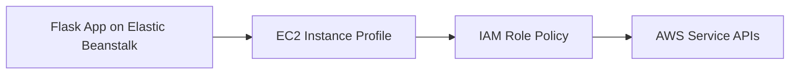

# Use IAM Instance Profiles with Python on Elastic Beanstalk

This recipe shows how to grant AWS API access to Elastic Beanstalk instances by using an IAM instance profile instead of static credentials. It is the standard AWS pattern for app-to-service access from EC2-based environments.

## Prerequisites

- Running Python Elastic Beanstalk environment.
- Permission to manage IAM roles, policies, and instance profiles.
- Target AWS service identified for application access.

## What You'll Build

You will build an Elastic Beanstalk environment that can call AWS APIs through the instance profile attached to its EC2 instances.



## Steps

### Step 1: Create an IAM role for Elastic Beanstalk EC2 instances

```bash
aws iam create-role \
    --role-name "$APP_NAME-eb-ec2-role" \
    --assume-role-policy-document file://trust-policy.json
```

Use this trust policy in `trust-policy.json`:

```json
{
    "Version": "2012-10-17",
    "Statement": [
        {
            "Effect": "Allow",
            "Principal": {
                "Service": "ec2.amazonaws.com"
            },
            "Action": "sts:AssumeRole"
        }
    ]
}
```

### Step 2: Attach least-privilege permissions

```bash
aws iam put-role-policy \
    --role-name "$APP_NAME-eb-ec2-role" \
    --policy-name "$APP_NAME-app-access" \
    --policy-document file://app-access-policy.json
```

Example `app-access-policy.json`:

```json
{
    "Version": "2012-10-17",
    "Statement": [
        {
            "Effect": "Allow",
            "Action": [
                "s3:GetObject",
                "s3:PutObject"
            ],
            "Resource": "arn:aws:s3:::$APP_NAME-bucket/*"
        }
    ]
}
```

### Step 3: Create an instance profile and add the role

```bash
aws iam create-instance-profile \
    --instance-profile-name "$APP_NAME-eb-ec2-profile"

aws iam add-role-to-instance-profile \
    --instance-profile-name "$APP_NAME-eb-ec2-profile" \
    --role-name "$APP_NAME-eb-ec2-role"
```

### Step 4: Attach the instance profile to the environment

```bash
aws elasticbeanstalk update-environment \
    --application-name "$APP_NAME" \
    --environment-name "$ENV_NAME" \
    --option-settings Namespace=aws:autoscaling:launchconfiguration,OptionName=IamInstanceProfile,Value="$APP_NAME-eb-ec2-profile" \
    --region "$REGION"
```

### Step 5: Confirm the app can call AWS without static keys

```python
import boto3
from flask import Flask

application = Flask(__name__)


@application.get("/identity-check")
def identity_check():
    sts = boto3.client("sts")
    identity = sts.get_caller_identity()
    return {"arn": identity["Arn"]}
```

## Verification

```bash
eb deploy --staged
curl --verbose "http://$CNAME/identity-check"
eb logs --all
```

Expected result: the route returns the assumed role ARN for the Elastic Beanstalk instance profile.

## Clean Up

Detach the instance profile from the environment, then remove the IAM resources:

```bash
aws iam remove-role-from-instance-profile \
    --instance-profile-name "$APP_NAME-eb-ec2-profile" \
    --role-name "$APP_NAME-eb-ec2-role"

aws iam delete-instance-profile \
    --instance-profile-name "$APP_NAME-eb-ec2-profile"

aws iam delete-role-policy \
    --role-name "$APP_NAME-eb-ec2-role" \
    --policy-name "$APP_NAME-app-access"

aws iam delete-role \
    --role-name "$APP_NAME-eb-ec2-role"
```

## See Also

- [Python Recipes Index](./index.md)
- [S3 Storage Recipe](./s3-storage.md)
- [Operations Section](../../../operations/index.md)

## Sources

- [Managing Elastic Beanstalk Instance Profiles](https://docs.aws.amazon.com/elasticbeanstalk/latest/dg/iam-instanceprofile.html)
- [IAM Roles for Amazon EC2](https://docs.aws.amazon.com/AWSEC2/latest/UserGuide/iam-roles-for-amazon-ec2.html)
- [Elastic Beanstalk Option Settings](https://docs.aws.amazon.com/elasticbeanstalk/latest/dg/command-options-general.html)
