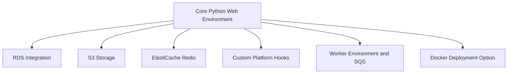

# Python Recipes on Elastic Beanstalk

This recipe collection extends the core Python tutorial track with integration and platform customization patterns documented by AWS.
Each recipe is designed for incremental adoption without assuming a production deployment.

## Prerequisites

- Completed core Python guide through deployment and configuration basics.
- Familiarity with environment properties and `.ebextensions` files.
- IAM permissions for related AWS services used in each recipe.

## What You'll Build

You will build optional capabilities around a Python Flask application:

- RDS connectivity with decoupled database lifecycle.
- ElastiCache Redis-backed caching in VPC contexts.
- S3 object storage integration using instance profile permissions.
- Platform hook customizations and NGINX extension points.
- Worker environment patterns using SQS and scheduled tasks.
- Docker-based deployment alternative to native Python platform.

## Steps

Choose recipes in this order if you want low-to-high operational complexity:

| Order | Recipe | Primary Service | Outcome |
|---|---|---|---|
| 1 | [rds-integration.md](./rds-integration.md) | Amazon RDS | Externalized relational data |
| 2 | [s3-storage.md](./s3-storage.md) | Amazon S3 | Durable object storage |
| 3 | [elasticache-redis.md](./elasticache-redis.md) | Amazon ElastiCache | Low-latency cache layer |
| 4 | [custom-platform-hooks.md](./custom-platform-hooks.md) | Platform hooks | Deployment lifecycle extensions |
| 5 | [worker-environments.md](./worker-environments.md) | Amazon SQS | Async and scheduled processing |
| 6 | [docker-deploy.md](./docker-deploy.md) | Docker on EB | Containerized deployment path |



## Verification

Before starting any recipe, run baseline checks:

```bash
eb status "$ENV_NAME"
eb printenv
eb logs --all
```

Recipe completion checks should include:

- Service-specific connectivity validation.
- Environment events and health review.
- Configuration committed to source control.
- No unmasked account IDs or sensitive tokens in docs output.

Suggested verification order for each recipe:

1. Confirm environment state with `eb status` and `eb health`.
2. Confirm configuration values with `eb printenv`.
3. Confirm logs with `eb logs --all`.
4. Confirm AWS service API visibility with targeted `aws` CLI commands.

Operational note from Elastic Beanstalk docs context:

- Prefer decoupled managed services (RDS, ElastiCache, S3) for durability and replacement-safe operations.
- Keep application versions immutable and traceable when testing recipe changes.
- Use masked placeholders in shared command outputs (`<account-id>`, `<db-password>`).

## See Also

- [Python Guide Index](../index.md)
- [Python Runtime](../python-runtime.md)
- [Operations Section](../../../operations/index.md)

## Sources

- [Elastic Beanstalk Developer Guide](https://docs.aws.amazon.com/elasticbeanstalk/latest/dg/Welcome.html)
