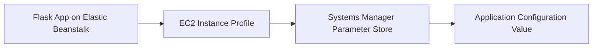

# Use Systems Manager Parameter Store with Python on Elastic Beanstalk

This recipe shows how to read configuration values from Systems Manager Parameter Store with `boto3`. It is useful for centrally managed application settings that should be referenced by name instead of copied into each environment.

## Prerequisites

- Running Python Elastic Beanstalk environment.
- IAM permission for `ssm:GetParameter` and `kms:Decrypt` if using `SecureString`.
- Existing parameter in Systems Manager Parameter Store.

## What You'll Build

You will build a Flask route that reads a parameter value at runtime by using the Elastic Beanstalk instance profile.



## Steps

### Step 1: Create a parameter

```bash
aws ssm put-parameter \
    --name "/$APP_NAME/config/api-base-url" \
    --type String \
    --value "https://api.example.internal" \
    --overwrite \
    --region "$REGION"
```

### Step 2: Grant the instance profile permission

```json
{
    "Version": "2012-10-17",
    "Statement": [
        {
            "Effect": "Allow",
            "Action": "ssm:GetParameter",
            "Resource": "arn:aws:ssm:$REGION:<account-id>:parameter/$APP_NAME/config/*"
        }
    ]
}
```

### Step 3: Store the parameter name in environment properties

```bash
aws elasticbeanstalk update-environment \
    --application-name "$APP_NAME" \
    --environment-name "$ENV_NAME" \
    --option-settings Namespace=aws:elasticbeanstalk:application:environment,OptionName=API_BASE_URL_PARAMETER,Value="/$APP_NAME/config/api-base-url" \
    --region "$REGION"
```

### Step 4: Load the parameter with boto3

```python
import os

import boto3
from flask import Flask

application = Flask(__name__)


def get_parameter(name: str) -> str:
    ssm = boto3.client("ssm", region_name=os.environ["AWS_REGION"])
    response = ssm.get_parameter(Name=name, WithDecryption=True)
    return response["Parameter"]["Value"]


@application.get("/config-check")
def config_check():
    return {"api_base_url": get_parameter(os.environ["API_BASE_URL_PARAMETER"])}
```

### Step 5: Deploy and test

```bash
eb deploy --staged
curl --verbose "http://$CNAME/config-check"
```

## Verification

- Confirm the environment property points to the expected parameter name.
- Confirm logs show successful Systems Manager API calls.
- Confirm the route returns the parameter value.

## Clean Up

```bash
aws ssm delete-parameter \
    --name "/$APP_NAME/config/api-base-url" \
    --region "$REGION"
```

Also remove the parameter access IAM policy and the `API_BASE_URL_PARAMETER` environment property if you no longer need them.

## See Also

- [Python Recipes Index](./index.md)
- [Secrets Manager Recipe](./secrets-manager.md)
- [VPC Endpoints Recipe](./vpc-endpoints.md)

## Sources

- [AWS Systems Manager Parameter Store](https://docs.aws.amazon.com/systems-manager/latest/userguide/systems-manager-parameter-store.html)
- [Boto3 Systems Manager Client](https://boto3.amazonaws.com/v1/documentation/api/latest/reference/services/ssm.html)
- [Elastic Beanstalk Environment Properties](https://docs.aws.amazon.com/elasticbeanstalk/latest/dg/environments-cfg-softwaresettings.html)
