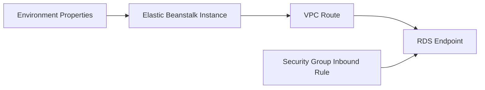

# Integrate Amazon RDS with Python on Elastic Beanstalk

This tutorial follows AWS guidance for connecting a Flask application to Amazon RDS from Elastic Beanstalk.
It emphasizes decoupled database lifecycle so environment replacement does not delete primary data.

## Prerequisites

- Running Python Elastic Beanstalk environment.
- Existing Amazon RDS instance (recommended decoupled from Elastic Beanstalk lifecycle).
- Security group rules allowing app-to-database connectivity on the DB engine port.
- SQLAlchemy installed in your application dependencies.

## What You'll Build

You will build:

- Environment properties for database connection settings.
- Flask + SQLAlchemy configuration that reads runtime variables.
- A simple connectivity validation path.

## Steps

1. Set database connection environment properties.

```bash
eb setenv DB_HOST="mydb.xxxxx.ap-northeast-2.rds.amazonaws.com" DB_PORT="5432" DB_NAME="appdb" DB_USER="appuser" DB_PASSWORD="<db-password>"
```

2. Add SQLAlchemy dependency.

```bash
python3 -m pip install SQLAlchemy psycopg2-binary
python3 -m pip freeze > requirements.txt
```

3. Configure Flask app connection factory.

```python
import os
from flask import Flask
from sqlalchemy import create_engine, text

application = Flask(__name__)


def build_database_url() -> str:
    return (
        f"postgresql+psycopg2://{os.environ['DB_USER']}:{os.environ['DB_PASSWORD']}"
        f"@{os.environ['DB_HOST']}:{os.environ['DB_PORT']}/{os.environ['DB_NAME']}"
    )


@application.get("/db-check")
def db_check():
    engine = create_engine(build_database_url())
    with engine.connect() as connection:
        connection.execute(text("SELECT 1"))
    return {"database": "reachable"}
```

4. Deploy updated app.

```bash
eb deploy --staged
```

5. Validate security groups and subnet reachability if the check fails.



## Verification

Run these checks after deployment:

```bash
eb printenv
eb logs --all
curl --verbose "http://$CNAME/db-check"
```

Expected outcomes:

- Environment variables are present.
- Application logs show successful DB connection test.
- `/db-check` returns a success payload.

## See Also

- [Configuration](../03-configuration.md)
- [First Deploy](../02-first-deploy.md)
- [S3 Storage Recipe](./s3-storage.md)

## Sources

- [Using Amazon RDS with Python and Elastic Beanstalk](https://docs.aws.amazon.com/elasticbeanstalk/latest/dg/create-deploy-python-rds.html)
