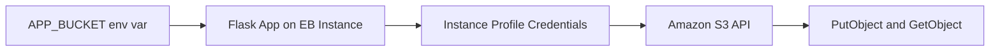

---
hide:
  - toc
---

# Use Amazon S3 from a Python Elastic Beanstalk App

This tutorial configures S3 object operations from a Flask app running in Elastic Beanstalk.
It follows AWS guidance to use instance profile permissions rather than embedded credentials.

## Prerequisites

- Running Python Elastic Beanstalk environment.
- IAM instance profile attached to environment instances.
- S3 bucket available for test uploads and downloads.
- `boto3` dependency in your application.

## What You'll Build

You will build:

- Least-privilege IAM access for S3 actions.
- Flask endpoint for upload and download checks.
- Environment-based bucket configuration.

## Steps

1. Set bucket name as environment property.

```bash
eb setenv APP_BUCKET="eb-python-guide-artifacts"
```

2. Install boto3 dependency.

```bash
python3 -m pip install boto3
python3 -m pip freeze > requirements.txt
```

3. Add minimal S3 integration code.

```python
import os
import boto3
from flask import Flask

application = Flask(__name__)
s3 = boto3.client("s3")


@application.get("/s3-check")
def s3_check():
    bucket = os.environ["APP_BUCKET"]
    key = "health/ping.txt"
    s3.put_object(Bucket=bucket, Key=key, Body=b"ok")
    obj = s3.get_object(Bucket=bucket, Key=key)
    body = obj["Body"].read().decode("utf-8")
    return {"bucket": bucket, "value": body}
```

4. Confirm IAM role policy includes required S3 actions.

```json
{
    "Version": "2012-10-17",
    "Statement": [
        {
            "Effect": "Allow",
            "Action": [
                "s3:GetObject",
                "s3:PutObject"
            ],
            "Resource": "arn:aws:s3:::eb-python-guide-artifacts/*"
        }
    ]
}
```

5. Deploy and test endpoint.

```bash
eb deploy --staged
curl --verbose "http://$CNAME/s3-check"
```



## Verification

Validate object operations and permissions:

```bash
eb logs --all
aws s3api head-object --bucket "$APP_BUCKET" --key "health/ping.txt" --region "$REGION"
```

Expected outcomes:

- Endpoint returns bucket and payload `ok`.
- Log output has no credential loading errors.
- Object metadata exists for the test key.

## See Also

- [RDS Integration Recipe](./rds-integration.md)
- [ElastiCache Redis Recipe](./elasticache-redis.md)
- [Python Runtime](../python-runtime.md)

## Sources

- [Using Amazon S3 with Elastic Beanstalk](https://docs.aws.amazon.com/elasticbeanstalk/latest/dg/AWSHowTo.S3.html)
