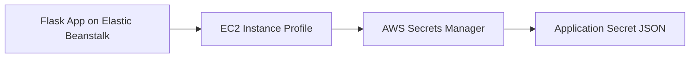

# Use AWS Secrets Manager with Python on Elastic Beanstalk

This recipe shows how to read application secrets from AWS Secrets Manager at runtime from a Python Elastic Beanstalk environment. It keeps credentials out of source control and avoids storing long-lived secret values directly in environment properties.

## Prerequisites

- Running Python Elastic Beanstalk environment.
- Instance profile permission for `secretsmanager:GetSecretValue` on the target secret.
- Existing secret in AWS Secrets Manager.
- `boto3` available in the application environment.

## What You'll Build

You will build a Flask route that loads a JSON secret from AWS Secrets Manager by using the Elastic Beanstalk instance profile.



## Steps

### Step 1: Create a secret and record its ARN

```bash
aws secretsmanager create-secret \
    --name "$APP_NAME/database" \
    --secret-string '{"username":"appuser","password":"<db-password>"}' \
    --region "$REGION"
```

### Step 2: Grant the Elastic Beanstalk instance profile access

```json
{
    "Version": "2012-10-17",
    "Statement": [
        {
            "Effect": "Allow",
            "Action": [
                "secretsmanager:GetSecretValue"
            ],
            "Resource": "arn:aws:secretsmanager:$REGION:<account-id>:secret:$APP_NAME/database-*"
        }
    ]
}
```

Attach the policy to the instance profile role used by your environment.

### Step 3: Store the secret identifier as an environment property

```bash
aws elasticbeanstalk update-environment \
    --application-name "$APP_NAME" \
    --environment-name "$ENV_NAME" \
    --option-settings Namespace=aws:elasticbeanstalk:application:environment,OptionName=APP_SECRET_ID,Value="$APP_NAME/database" \
    --region "$REGION"
```

### Step 4: Load the secret in Flask with boto3

```python
import json
import os

import boto3
from flask import Flask

application = Flask(__name__)


def get_secret(secret_id: str) -> dict:
    client = boto3.client("secretsmanager", region_name=os.environ["AWS_REGION"])
    response = client.get_secret_value(SecretId=secret_id)
    return json.loads(response["SecretString"])


@application.get("/secret-check")
def secret_check():
    secret = get_secret(os.environ["APP_SECRET_ID"])
    return {
        "username": secret["username"],
        "password_loaded": bool(secret["password"])
    }
```

### Step 5: Deploy and validate

```bash
eb deploy --staged
```

## Verification

```bash
eb printenv
eb logs --all
curl --verbose "http://$CNAME/secret-check"
```

Expected result: the route returns the secret metadata without exposing the raw password value.

## Clean Up

```bash
aws secretsmanager delete-secret \
    --secret-id "$APP_NAME/database" \
    --force-delete-without-recovery \
    --region "$REGION"
```

Also remove the IAM policy statement and the `APP_SECRET_ID` environment property when you no longer need the integration.

## See Also

- [Python Recipes Index](./index.md)
- [S3 Storage Recipe](./s3-storage.md)
- [Configuration](../03-configuration.md)

## Sources

- [AWS Secrets Manager User Guide](https://docs.aws.amazon.com/secretsmanager/latest/userguide/intro.html)
- [Boto3 Secrets Manager Client](https://boto3.amazonaws.com/v1/documentation/api/latest/reference/services/secretsmanager.html)
- [Elastic Beanstalk Environment Configuration](https://docs.aws.amazon.com/elasticbeanstalk/latest/dg/environments-cfg-softwaresettings.html)
