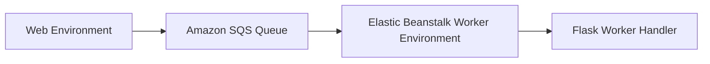

# Build an SQS Worker Environment with Python on Elastic Beanstalk

This recipe shows how to pair a Python worker environment with Amazon SQS for asynchronous job processing. It is useful when background tasks should not run in the web request path.

## Prerequisites

- Running Python Elastic Beanstalk application.
- Permission to create and use Amazon SQS queues.
- Separate worker environment or plan to create one.
- Flask application code that can process queued jobs.

## What You'll Build

You will build a worker tier environment that receives messages from Amazon SQS and processes them through a Flask application endpoint.



## Steps

### Step 1: Create a queue for background jobs

```bash
aws sqs create-queue \
    --queue-name "$APP_NAME-worker" \
    --region "$REGION"
```

### Step 2: Create or update the worker environment

```bash
aws elasticbeanstalk create-environment \
    --application-name "$APP_NAME" \
    --environment-name "$ENV_NAME-worker" \
    --solution-stack-name "64bit Amazon Linux 2023 v4.3.2 running Python 3.11" \
    --tier Name=Worker,Type=SQS/HTTP,Version=\"1.0\" \
    --option-settings Namespace=aws:elasticbeanstalk:sqsd,OptionName=WorkerQueueURL,Value="https://sqs.$REGION.amazonaws.com/<account-id>/$APP_NAME-worker" \
    --region "$REGION"
```

### Step 3: Add a worker endpoint to the Flask app

```python
import json
from flask import Flask, request

application = Flask(__name__)


@application.post("/worker")
def worker():
    payload = json.loads(request.data)
    return {"processed": payload["job_type"]}
```

### Step 4: Send messages from the web app or CLI

```python
import json
import boto3

sqs = boto3.client("sqs")


def enqueue_job(queue_url: str, job_type: str) -> None:
    sqs.send_message(
        QueueUrl=queue_url,
        MessageBody=json.dumps({"job_type": job_type})
    )
```

### Step 5: Deploy and test background processing

```bash
eb deploy --staged

aws sqs send-message \
    --queue-url "https://sqs.$REGION.amazonaws.com/<account-id>/$APP_NAME-worker" \
    --message-body '{"job_type":"email"}' \
    --region "$REGION"
```

## Verification

```bash
eb logs --all
aws sqs get-queue-attributes \
    --queue-url "https://sqs.$REGION.amazonaws.com/<account-id>/$APP_NAME-worker" \
    --attribute-names ApproximateNumberOfMessages \
    --region "$REGION"
```

Expected result: worker logs show message processing and the queue depth returns to zero after successful consumption.

## Clean Up

```bash
aws elasticbeanstalk terminate-environment \
    --environment-name "$ENV_NAME-worker" \
    --terminate-resources \
    --region "$REGION"

aws sqs delete-queue \
    --queue-url "https://sqs.$REGION.amazonaws.com/<account-id>/$APP_NAME-worker" \
    --region "$REGION"
```

## See Also

- [Python Recipes Index](./index.md)
- [Worker Environments Recipe](./worker-environments.md)
- [Operations Section](../../../operations/index.md)

## Sources

- [Elastic Beanstalk Worker Environments](https://docs.aws.amazon.com/elasticbeanstalk/latest/dg/using-features-managing-env-tiers.html)
- [Amazon SQS Developer Guide](https://docs.aws.amazon.com/AWSSimpleQueueService/latest/SQSDeveloperGuide/welcome.html)
- [Boto3 SQS Client](https://boto3.amazonaws.com/v1/documentation/api/latest/reference/services/sqs.html)
