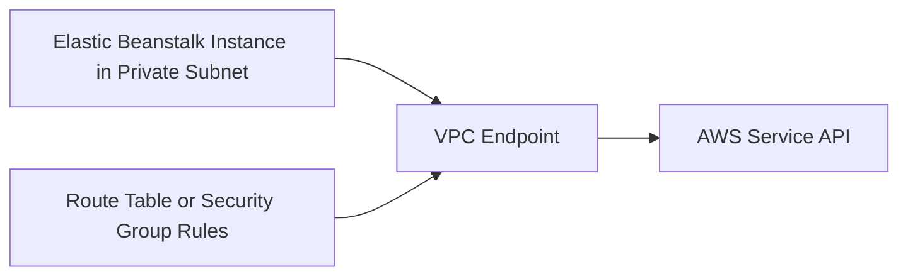

# Use VPC Endpoints with Python on Elastic Beanstalk

This recipe shows how to keep service traffic inside your VPC by using VPC endpoints for AWS services such as S3, DynamoDB, Systems Manager, or Secrets Manager. It is useful for private environments without internet egress.

## Prerequisites

- Running Elastic Beanstalk environment in a VPC.
- Private subnets and route tables identified for the environment.
- Permission to create VPC endpoints and update security groups.

## What You'll Build

You will build a private Elastic Beanstalk environment that reaches AWS services through VPC endpoints instead of a public internet path.



## Steps

### Step 1: Identify the VPC, subnets, and route tables

```bash
aws elasticbeanstalk describe-environment-resources \
    --environment-name "$ENV_NAME" \
    --region "$REGION"
```

### Step 2: Create a gateway endpoint for Amazon S3

```bash
aws ec2 create-vpc-endpoint \
    --vpc-id "$VPC_ID" \
    --service-name "com.amazonaws.$REGION.s3" \
    --vpc-endpoint-type Gateway \
    --route-table-ids "$ROUTE_TABLE_ID" \
    --region "$REGION"
```

### Step 3: Create an interface endpoint for Secrets Manager

```bash
aws ec2 create-vpc-endpoint \
    --vpc-id "$VPC_ID" \
    --service-name "com.amazonaws.$REGION.secretsmanager" \
    --vpc-endpoint-type Interface \
    --subnet-ids "$SUBNET_ID" \
    --security-group-ids "$SECURITY_GROUP_ID" \
    --private-dns-enabled \
    --region "$REGION"
```

### Step 4: Keep application code using the normal AWS SDK endpoint

```python
import boto3


def get_parameter(name: str) -> str:
    ssm = boto3.client("ssm")
    response = ssm.get_parameter(Name=name, WithDecryption=True)
    return response["Parameter"]["Value"]
```

With private DNS enabled, the SDK continues using the standard regional endpoint name while traffic stays inside the VPC.

### Step 5: Redeploy and test from the private environment

```bash
eb deploy --staged
eb logs --all
```

## Verification

- Confirm the endpoint status is `available`.
- Confirm private instances can reach the target service without a NAT gateway dependency.
- Confirm application logs show successful AWS API calls.

```bash
aws ec2 describe-vpc-endpoints \
    --filters Name=vpc-id,Values="$VPC_ID" \
    --region "$REGION"
```

## Clean Up

```bash
aws ec2 delete-vpc-endpoints \
    --vpc-endpoint-ids "$VPC_ENDPOINT_ID" \
    --region "$REGION"
```

Remove any temporary security group rules that were added only for testing.

## See Also

- [Python Recipes Index](./index.md)
- [Secrets Manager Recipe](./secrets-manager.md)
- [Parameter Store Recipe](./parameter-store.md)

## Sources

- [VPC Endpoints](https://docs.aws.amazon.com/vpc/latest/privatelink/vpc-endpoints.html)
- [Gateway Endpoints for Amazon S3 and DynamoDB](https://docs.aws.amazon.com/vpc/latest/privatelink/gateway-endpoints.html)
- [Interface Endpoints](https://docs.aws.amazon.com/vpc/latest/privatelink/interface-endpoints.html)
