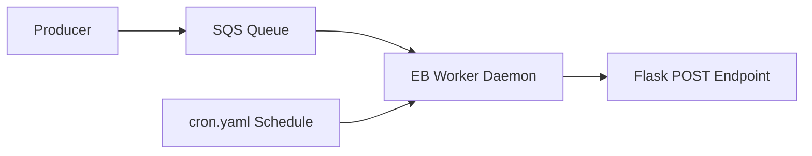

# Build Worker Environments with SQS

This tutorial introduces Elastic Beanstalk worker environments for asynchronous processing.
It follows AWS guidance for queue-driven processing and scheduled tasks with `cron.yaml`.

## Prerequisites

- Existing Elastic Beanstalk application.
- SQS queue access and IAM permissions.
- Worker tier environment created or planned.
- Python Flask app that can accept worker POST payloads.

## What You'll Build

You will build:

- A worker-tier Elastic Beanstalk environment.
- SQS-driven message handling endpoint in Flask.
- Scheduled task definition with `cron.yaml`.

## Steps

1. Create or identify worker environment.

```bash
eb create "$WORKER_ENV_NAME" --tier worker
```

2. Add Flask endpoint for worker message processing.

```python
from flask import Flask, request

application = Flask(__name__)


@application.post("/")
def process_message():
    payload = request.get_json(silent=True) or {}
    # Process payload according to your application contract.
    return {"received": bool(payload)}
```

3. Add `cron.yaml` for scheduled worker tasks.

```yaml
version: 1
cron:
    - name: nightly-task
      url: "/"
      schedule: "0 2 * * *"
```

4. Set environment variables needed by worker logic.

```bash
eb setenv WORKER_MODE="enabled" TASK_NAME="nightly-task"
```

5. Deploy to worker environment.

```bash
eb deploy "$WORKER_ENV_NAME" --staged
```

6. Observe queue consumer behavior and event logs.

```bash
eb events "$WORKER_ENV_NAME" --follow
eb logs "$WORKER_ENV_NAME" --all
```



## Verification

Validate worker workflow:

```bash
eb status "$WORKER_ENV_NAME"
aws sqs get-queue-attributes --queue-url "$QUEUE_URL" --attribute-names ApproximateNumberOfMessages --region "$REGION"
```

Expected outcomes:

- Worker environment reports healthy state.
- Queue messages are consumed and processed.
- Scheduled entries from `cron.yaml` trigger at expected intervals.

## See Also

- [First Deploy](../02-first-deploy.md)
- [Logging and Monitoring](../04-logging-monitoring.md)
- [CI/CD](../06-ci-cd.md)

## Sources

- [Web server and worker environment tiers](https://docs.aws.amazon.com/elasticbeanstalk/latest/dg/using-features-managing-env-tiers.html)
