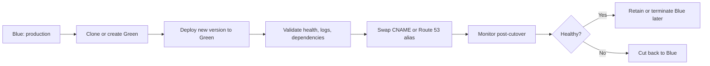

# Blue/Green Deployment Operations

## Prerequisites

-    Two Elastic Beanstalk environments are available or can be created: current production blue and candidate green.
-    Application version artifact is already built, uploaded, and traceable by immutable version label.
-    Environment configuration differences between blue and green are reviewed and intentional.
-    Route 53 hosted zone access is available if DNS alias records are part of the cutover strategy.
-    Enhanced health is enabled so promotion decisions use more than load balancer status alone.

## When to Use

-    Use when production cutover must be fast and rollback must be equally fast.
-    Use when platform version, operating system, or environment-level configuration changes need full parallel validation.
-    Use when you want to compare blue and green side by side before promotion.
-    Use instead of rolling deployment when you cannot accept in-place capacity churn in the live environment.

## Procedure

Choose the deployment model that matches the risk profile.

| Deployment policy | Best fit | Why not choose it |
| --- | --- | --- |
| Blue/Green | High-confidence production promotions and quick rollback | Requires duplicate environment cost during validation |
| Rolling | Low-cost incremental updates | Existing environment changes in place |
| Immutable | Safer in-place replacement within one environment | Rollback is slower than CNAME or DNS cutback |

Create or clone the green environment.

```bash
eb clone "my-app-prod" \
    --clone_name "my-app-green" \
    --cname "my-app-green" \
    --profile "eb-ops" \
    --region "us-east-1"
```

Deploy the target version to green.

```bash
eb deploy "my-app-green" \
    --label "release-2026-04-07" \
    --message "Promote validated artifact to green" \
    --timeout 20 \
    --profile "eb-ops" \
    --region "us-east-1"
```

Verify environment state with AWS CLI before cutover.

```bash
aws elasticbeanstalk describe-environments \
    --application-name "my-app" \
    --environment-names "my-app-prod" "my-app-green" \
    --region "us-east-1" \
    --profile "eb-ops"

aws elasticbeanstalk describe-environment-health \
    --environment-name "my-app-green" \
    --attribute-names "All" \
    --region "us-east-1" \
    --profile "eb-ops"
```

Promote with Elastic Beanstalk CNAME swap when the environment URL is the traffic entry point.

```bash
aws elasticbeanstalk swap-environment-cnames \
    --source-environment-name "my-app-green" \
    --destination-environment-name "my-app-prod" \
    --region "us-east-1" \
    --profile "eb-ops"
```

If Route 53 alias records are the public entry point, update DNS after or instead of CNAME swap based on your routing design.

```bash
aws route53 change-resource-record-sets \
    --hosted-zone-id "Z1234567890ABC" \
    --change-batch '{
        "Comment": "Switch production alias to green load balancer",
        "Changes": [
            {
                "Action": "UPSERT",
                "ResourceRecordSet": {
                    "Name": "app.example.com",
                    "Type": "A",
                    "AliasTarget": {
                        "HostedZoneId": "Z35SXDOTRQ7X7K",
                        "DNSName": "dualstack.my-app-green-123456789.us-east-1.elb.amazonaws.com",
                        "EvaluateTargetHealth": true
                    }
                }
            }
        ]
    }' \
    --profile "eb-ops" \
    --region "us-east-1"
```



Operational notes:

-    Blue/green is the best choice when the environment itself is part of the change.
-    Databases are usually shared or migrated separately; environment cloning does not copy live data automatically.
-    Keep blue running until green has passed both health and application verification.

## Verification

-    Confirm green environment status is `Ready` and enhanced health is Green before cutover.
-    Confirm deployment version label on green matches the release plan.
-    Confirm Route 53 alias or Elastic Beanstalk CNAME now resolves to the intended target.
-    Confirm critical application paths, authentication flow, background processing, and downstream dependencies work after cutover.
-    Confirm recent environment events show successful deploy and swap activity with no unresolved warnings.

## Rollback / Troubleshooting

-    If cutover fails after CNAME swap, run the same swap command in reverse to return traffic to blue.
-    If Route 53 alias cutover causes regression, restore the previous alias target immediately.
-    If green fails validation before cutover, keep blue serving and redeploy or rebuild green.
-    If environment differences caused the incident, diff configuration settings before retrying.
-    If the issue is data-layer related, stop traffic changes first and follow the application rollback plan separately from the environment rollback.

## See Also

-    [Operations Index](./index.md)
-    [Environment Management Operations](./environment-management.md)
-    [Immutable Deployment Operations](./immutable-deployment.md)
-    [Updates and Patching Operations](./updates-and-patching.md)
-    [Platform: How Elastic Beanstalk Works](../platform/how-elastic-beanstalk-works.md)
-    [Reference: EB Diagnostics](../reference/eb-diagnostics.md)

## Sources

-    [Blue/Green deployments with Elastic Beanstalk](https://docs.aws.amazon.com/elasticbeanstalk/latest/dg/using-features.CNAMESwap.html)
-    [Clone an Elastic Beanstalk environment](https://docs.aws.amazon.com/elasticbeanstalk/latest/dg/using-features.managing.clone.html)
-    [Managing Elastic Beanstalk environments](https://docs.aws.amazon.com/elasticbeanstalk/latest/dg/using-features.managing.html)
-    [Elastic Beanstalk Command Line Interface (EB CLI)](https://docs.aws.amazon.com/elasticbeanstalk/latest/dg/eb-cli3.html)
-    [Amazon Route 53 using alias records](https://docs.aws.amazon.com/Route53/latest/DeveloperGuide/routing-to-elb-load-balancer.html)
