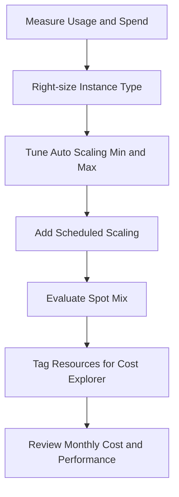

---
hide:
  - toc
---

# Cost Optimization Operations

## Prerequisites

-    Environment inventory including instance types, environment type, and traffic profile.
-    Access to Elastic Beanstalk configuration options and Auto Scaling settings.
-    Access to Cost Explorer and tagging strategy for cost allocation.
-    Understanding of business-hour demand and off-hour availability requirements.
-    Reserved Instance or Savings planning process for steady-state workloads.

## When to Use

-    Use when spend has increased due to over-provisioned instance size or count.
-    Use when workloads have predictable schedules and can scale down off-hours.
-    Use when evaluating Spot usage for non-critical or interruption-tolerant capacity.
-    Use when deciding between single-instance and load-balanced architecture cost profiles.

## Procedure

Review current environment EC2 settings and scaling boundaries.

```bash
aws elasticbeanstalk describe-configuration-settings \
    --application-name "my-app" \
    --environment-name "my-app-prod" \
    --profile "eb-ops" \
    --region "us-east-1"
```

Right-size instance type based on observed utilization and request profile.

```bash
aws elasticbeanstalk update-environment \
    --environment-name "my-app-prod" \
    --option-settings Namespace=aws:autoscaling:launchconfiguration,OptionName=InstanceType,Value=t3.medium \
    --profile "eb-ops" \
    --region "us-east-1"
```

Tune Auto Scaling minimum and maximum size to remove idle over-capacity.

```bash
aws elasticbeanstalk update-environment \
    --environment-name "my-app-prod" \
    --option-settings Namespace=aws:autoscaling:asg,OptionName=MinSize,Value=2 Namespace=aws:autoscaling:asg,OptionName=MaxSize,Value=5 \
    --profile "eb-ops" \
    --region "us-east-1"
```

Configure scheduled scaling for business hours and off-hours.

```bash
aws elasticbeanstalk update-environment \
    --environment-name "my-app-prod" \
    --option-settings Namespace=aws:autoscaling:scheduledaction,ResourceName=WeekdayUp,OptionName=DesiredCapacity,Value=4 \
    Namespace=aws:autoscaling:scheduledaction,ResourceName=WeekdayUp,OptionName=Recurrence,Value="0 8 * * 1-5" \
    Namespace=aws:autoscaling:scheduledaction,ResourceName=WeekdayDown,OptionName=DesiredCapacity,Value=2 \
    Namespace=aws:autoscaling:scheduledaction,ResourceName=WeekdayDown,OptionName=Recurrence,Value="0 20 * * 1-5" \
    --profile "eb-ops" \
    --region "us-east-1"
```

Evaluate Spot usage for part of the fleet through Auto Scaling policy options.

1.    Keep baseline capacity on On-Demand instances.
2.    Add Spot capacity where interruption can be tolerated.
3.    Validate scaling and recovery behavior under interruption conditions.

Apply consistent tags to support Cost Explorer grouping.

```bash
aws elasticbeanstalk update-tags-for-resource \
    --resource-arn "arn:aws:elasticbeanstalk:us-east-1:<account-id>:environment/my-app/my-app-prod" \
    --tags-to-add Key=CostCenter,Value=WebPlatform Key=Environment,Value=Production \
    --profile "eb-ops" \
    --region "us-east-1"
```

Choose architecture based on uptime and traffic needs:

-    Single-instance lowers cost but reduces availability and removes load balancer redundancy.
-    Load-balanced environments increase cost but improve resilience and scaling flexibility.



Cost-aware guidance from AWS docs:

-    Elastic Beanstalk itself has no additional charge; costs come from underlying resources.
-    Auto Scaling and scheduled actions are core tools for cost-performance balance.
-    Spot can reduce spend but needs handling for interruptions.
-    Reserved purchasing options apply as billing discounts to matching usage.

## Verification

-    Confirm updated instance type and scaling limits are applied and stable.
-    Confirm scheduled actions trigger at expected times and adjust desired capacity.
-    Confirm tagged resources appear in Cost Explorer allocation views.
-    Confirm latency and error metrics remain acceptable after cost changes.

## Rollback / Troubleshooting

-    Revert instance type if right-sizing causes sustained high utilization.
-    Raise minimum capacity if scale-down causes request saturation.
-    Remove or adjust schedule actions that conflict with real demand patterns.
-    Reduce Spot ratio if interruption churn affects user-facing reliability.
-    Reassess single-instance mode if availability requirements are not met.

## See Also

-    [Scaling](./scaling.md)
-    [Environment Management](./environment-management.md)
-    [Common Anti-Patterns](../best-practices/common-anti-patterns.md)
-    [Platform Limits](../reference/platform-limits.md)

## Sources

-    https://docs.aws.amazon.com/elasticbeanstalk/latest/dg/using-features.managing.ec2.html
-    https://docs.aws.amazon.com/elasticbeanstalk/latest/dg/using-features.managing.as.html
-    https://docs.aws.amazon.com/elasticbeanstalk/latest/dg/environments-cfg-autoscaling-scheduledactions.html
-    https://docs.aws.amazon.com/elasticbeanstalk/latest/dg/environments-cfg-autoscaling-spot.html
-    https://docs.aws.amazon.com/elasticbeanstalk/latest/dg/Welcome.html
