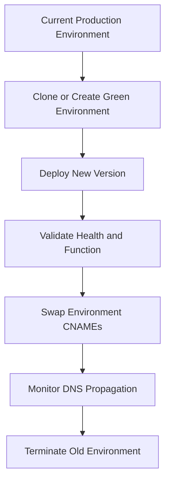

# Environment Management Operations

## Prerequisites

-    Permissions to create, clone, rebuild, and terminate Elastic Beanstalk environments.
-    Access to application versions and known-good configurations.
-    DNS understanding for CNAME swap behavior and propagation timing.
-    Saved configuration naming convention for reproducible restore points.
-    Separate database lifecycle plan if environments include coupled databases.

## When to Use

-    Use when creating a new development, test, staging, or production environment.
-    Use when cloning an environment to test platform changes or configuration updates safely.
-    Use when performing blue/green deployments with CNAME swap for near-instant traffic cutover.
-    Use when restoring environment consistency by rebuild after invalid or unmanaged changes.
-    Use when linking component environments such as web and worker tiers.

## Procedure

Create a new environment from an application version.

```bash
aws elasticbeanstalk create-environment \
    --application-name "my-app" \
    --environment-name "my-app-stage" \
    --solution-stack-name "64bit Amazon Linux 2 v3.8.1 running Python 3.11" \
    --version-label "app-2026-04-05" \
    --profile "eb-ops" \
    --region "us-east-1"
```

Save the current configuration before major changes.

```bash
aws elasticbeanstalk create-configuration-template \
    --application-name "my-app" \
    --template-name "prod-baseline-2026-04-05" \
    --environment-id "e-abc123def4" \
    --profile "eb-ops" \
    --region "us-east-1"
```

Clone an environment to keep option settings and attached managed resources aligned.

```bash
eb clone "my-app-prod" --clone_name "my-app-green" --cname "my-app-green"
```

Deploy and validate the candidate environment, then perform CNAME swap.

```bash
aws elasticbeanstalk swap-environment-cnames \
    --source-environment-name "my-app-green" \
    --destination-environment-name "my-app-prod" \
    --profile "eb-ops" \
    --region "us-east-1"
```

Rebuild a running environment when resources are invalid due to unmanaged drift.

```bash
aws elasticbeanstalk rebuild-environment \
    --environment-id "e-abc123def4" \
    --profile "eb-ops" \
    --region "us-east-1"
```

Terminate an obsolete environment after DNS cutover and validation are complete.

```bash
aws elasticbeanstalk terminate-environment \
    --environment-name "my-app-old" \
    --profile "eb-ops" \
    --region "us-east-1"
```

Define environment links through `env.yaml` and process application versions.

```bash
aws elasticbeanstalk create-application-version \
    --application-name "my-app" \
    --version-label "frontend-v2" \
    --source-bundle S3Bucket="elasticbeanstalk-us-east-1-<account-id>",S3Key="frontend-v2.zip" \
    --process \
    --profile "eb-ops" \
    --region "us-east-1"
```



Operational safeguards from AWS docs:

-    Cloning does not copy Amazon RDS data automatically.
-    Cloning does not carry unmanaged ingress security group changes.
-    Terminated environment restore can fail if the subdomain was reused.
-    Rebuild can delete coupled databases unless lifecycle policies are configured.
-    Terminating linked environments requires unlinking first or forced termination.

## Verification

-    Confirm target environment status is Ready and health is Green.
-    Confirm post-swap production URL resolves to the intended environment.
-    Confirm events show successful clone, deploy, swap, rebuild, or terminate actions.
-    Confirm saved configuration object is available for future recovery.

## Rollback / Troubleshooting

-    Swap CNAMEs back immediately if green validation fails after cutover.
-    Reapply a saved configuration to restore expected option settings.
-    If rebuild fails, inspect missing application versions and name or URL conflicts.
-    If termination fails, inspect security group dependency references and environment links.
-    Delete dangling DNS mappings after environment termination to prevent hostname takeover risk.

## See Also

-    [Blue/Green Deployment](./blue-green-deployment.md)
-    [Immutable Deployment](./immutable-deployment.md)
-    [Scaling](./scaling.md)
-    [How Elastic Beanstalk Works](../platform/how-elastic-beanstalk-works.md)

## Sources

-    https://docs.aws.amazon.com/elasticbeanstalk/latest/dg/using-features.managing.html
-    https://docs.aws.amazon.com/elasticbeanstalk/latest/dg/using-features.managing.clone.html
-    https://docs.aws.amazon.com/elasticbeanstalk/latest/dg/using-features.CNAMESwap.html
-    https://docs.aws.amazon.com/elasticbeanstalk/latest/dg/environment-configuration-savedconfig.html
-    https://docs.aws.amazon.com/elasticbeanstalk/latest/dg/environment-management-rebuild.html
-    https://docs.aws.amazon.com/elasticbeanstalk/latest/dg/environment-cfg-links.html
-    https://docs.aws.amazon.com/elasticbeanstalk/latest/dg/using-features.terminating.html
