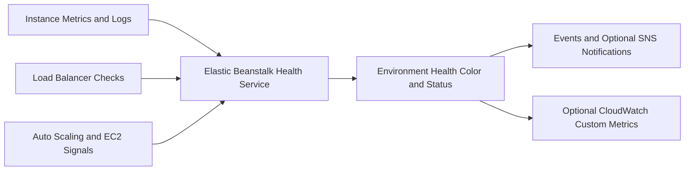

---
hide:
  - toc
---

# Health Monitoring Operations

## Prerequisites

-    Elastic Beanstalk environment with basic or enhanced health reporting enabled.
-    Required service role and instance profile permissions for enhanced health.
-    Access to CloudWatch metrics and Elastic Beanstalk events.
-    Optional Amazon SNS topic for environment event notifications.
-    Application health endpoint that returns HTTP 200 when service is healthy.

## When to Use

-    Use when you need to understand current environment health state and causes.
-    Use when migrating from basic health to enhanced health visibility.
-    Use during deployments, scaling, and platform updates to observe health transitions.
-    Use when building operational alerts and automated response around degraded service.

## Procedure

Check environment status, health, and health color directly.

```bash
aws elasticbeanstalk describe-environments \
    --application-name "my-app" \
    --environment-names "my-app-prod" \
    --profile "eb-ops" \
    --region "us-east-1"
```

Review recent health-related events and causes.

```bash
aws elasticbeanstalk describe-events \
    --environment-name "my-app-prod" \
    --max-records 100 \
    --profile "eb-ops" \
    --region "us-east-1"
```

Enable enhanced health reporting and authorization when needed.

```bash
aws elasticbeanstalk update-environment \
    --environment-name "my-app-prod" \
    --option-settings Namespace=aws:elasticbeanstalk:healthreporting:system,OptionName=SystemType,Value=enhanced \
    Namespace=aws:elasticbeanstalk:healthreporting:system,OptionName=EnhancedHealthAuthEnabled,Value=true \
    --profile "eb-ops" \
    --region "us-east-1"
```

Publish enhanced health metrics to CloudWatch for historical tracking.

```bash
aws elasticbeanstalk update-environment \
    --environment-name "my-app-prod" \
    --option-settings Namespace=aws:elasticbeanstalk:healthreporting:system,OptionName=ConfigDocument,Value='{"CloudWatchMetrics":{"Environment":true,"Instance":true}}' \
    --profile "eb-ops" \
    --region "us-east-1"
```

Configure SNS notifications for environment events.

```bash
aws elasticbeanstalk update-environment \
    --environment-name "my-app-prod" \
    --option-settings Namespace=aws:elasticbeanstalk:sns:topics,OptionName=Notification Topic ARN,Value=arn:aws:sns:us-east-1:<account-id>:eb-ops-alerts \
    Namespace=aws:elasticbeanstalk:sns:topics,OptionName=Notification Protocol,Value=email \
    Namespace=aws:elasticbeanstalk:sns:topics,OptionName=Notification Endpoint,Value=ops-team@example.com \
    --profile "eb-ops" \
    --region "us-east-1"
```

Health interpretation model from AWS docs:

-    `Green`: health checks are passing and service is available.
-    `Yellow`: one or more checks are failing and some requests may fail.
-    `Red`: repeated failures or unavailable resources indicate severe service impact.
-    `Grey`: environment updates are in progress or health cannot yet be determined.



Operational notes:

-    Enhanced health agent reports frequently, and environment-level health is published regularly.
-    During rolling operations, instances can remain Pending while commands execute and stabilize.
-    Health success threshold settings can be tuned when an application is stable below strict OK behavior.
-    Configure a real application path for load balancer health checks to avoid false healthy signals.

## Verification

-    Confirm health color is expected and cause messages are actionable.
-    Confirm all instances in the batch transition from Pending to healthy after updates.
-    Confirm CloudWatch receives expected health metrics when custom publishing is enabled.
-    Confirm SNS notifications are delivered to subscribed endpoints.

## Rollback / Troubleshooting

-    If enhanced health shows No Data, verify instance profile permission for `elasticbeanstalk:PutInstanceStatistics`.
-    If health degrades after deployment, inspect command timeout and health check URL behavior.
-    If false failures occur during startup, use a health check path served by the application runtime.
-    If event noise is high, tune health rules and deployment batching to reduce transient alerts.

## See Also

-    [Scaling](./scaling.md)
-    [Updates and Patching](./updates-and-patching.md)
-    [Troubleshooting Decision Tree](../troubleshooting/decision-tree.md)
-    [Evidence Map](../troubleshooting/evidence-map.md)

## Sources

-    https://docs.aws.amazon.com/elasticbeanstalk/latest/dg/health-enhanced.html
-    https://docs.aws.amazon.com/elasticbeanstalk/latest/dg/using-features.healthstatus.html
-    https://docs.aws.amazon.com/elasticbeanstalk/latest/dg/health-enhanced-status.html
-    https://docs.aws.amazon.com/elasticbeanstalk/latest/dg/environments-health-enhanced-notifications.html
-    https://docs.aws.amazon.com/elasticbeanstalk/latest/dg/health-enhanced-cloudwatch.html
