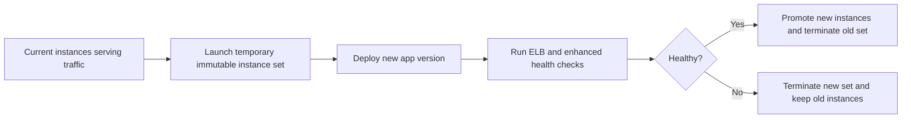

# Immutable Deployment Operations

## Prerequisites

-    Environment uses a load-balanced web tier where temporary extra capacity for immutable deployment is acceptable.
-    Application startup, health check path, and dependency readiness are already well-defined.
-    Enhanced health is enabled so Elastic Beanstalk can evaluate new capacity before replacing old instances.
-    Artifact version label is immutable and mapped to a known build.
-    Instance profile, security groups, and subnets are ready for new instance launch in parallel with the current fleet.

## When to Use

-    Use when you need safer in-place deployment than rolling updates.
-    Use when startup regressions are possible and old capacity must remain intact until new instances pass health checks.
-    Use when you want deployment isolation without creating a full parallel environment as in blue/green.
-    Use when additional temporary EC2 capacity cost is acceptable during the update window.

## Procedure

Immutable updates launch a temporary Auto Scaling group of new instances, deploy the target version there, validate health, and only then retire the old instances.



Inspect the current deployment policy.

```bash
aws elasticbeanstalk describe-configuration-settings \
    --application-name "my-app" \
    --environment-name "my-app-prod" \
    --profile "eb-ops" \
    --region "us-east-1"
```

Set the environment to immutable deployment policy.

```bash
aws elasticbeanstalk update-environment \
    --environment-name "my-app-prod" \
    --option-settings Namespace=aws:elasticbeanstalk:command,OptionName=DeploymentPolicy,Value=Immutable \
    --profile "eb-ops" \
    --region "us-east-1"
```

Deploy the target application version.

```bash
eb deploy "my-app-prod" \
    --label "release-2026-04-07" \
    --message "Immutable production deploy" \
    --timeout 30 \
    --profile "eb-ops" \
    --region "us-east-1"
```

Monitor deployment progress and health.

```bash
aws elasticbeanstalk describe-events \
    --environment-name "my-app-prod" \
    --max-records 100 \
    --profile "eb-ops" \
    --region "us-east-1"

aws elasticbeanstalk describe-environment-health \
    --environment-name "my-app-prod" \
    --attribute-names "All" \
    --profile "eb-ops" \
    --region "us-east-1"

aws elasticbeanstalk describe-instances-health \
    --environment-name "my-app-prod" \
    --attribute-names "All" \
    --profile "eb-ops" \
    --region "us-east-1"
```

Immutable versus other deployment choices:

| Policy | Best for | Main risk | Cost profile |
| --- | --- | --- | --- |
| Rolling | Fast, low extra capacity | Live fleet changes progressively | Lowest |
| Rolling with additional batch | More headroom than rolling | Still updates the live environment in place | Low to medium |
| Immutable | Safer single-environment replacement | Requires launchable replacement capacity | Medium |
| Blue/Green | Highest change isolation | Requires whole extra environment | Highest during overlap |

Cost implications:

-    New instances run in parallel with old ones during the immutable window.
-    Load balancer, NAT, and downstream dependency load can temporarily increase.
-    Instance-hour cost is usually lower than blue/green, but higher than rolling updates.

## Verification

-    Confirm environment events show immutable deployment stages completed successfully.
-    Confirm new instances pass target group health checks and enhanced health checks.
-    Confirm the environment remains `Ready` with healthy color state after old instances are retired.
-    Confirm application version label on the environment matches the target release.
-    Confirm critical paths and background jobs behave normally after instance replacement.

## Rollback / Troubleshooting

-    If immutable deployment fails health checks, Elastic Beanstalk keeps the old fleet and terminates the failed replacement set.
-    If application issues appear after success, redeploy the previous known-good version label.
-    If new instances cannot launch, inspect subnet capacity, quotas, security group references, and instance profile permissions.
-    If startup is too slow, fix health check path, timeout assumptions, or dependency initialization before retrying.
-    If immutable deployment cost is too high for the service, evaluate blue/green for controlled windows or rolling for lower-risk noncritical environments.

## See Also

-    [Operations Index](./index.md)
-    [Blue/Green Deployment Operations](./blue-green-deployment.md)
-    [Updates and Patching Operations](./updates-and-patching.md)
-    [Health Monitoring Operations](./health-monitoring.md)
-    [Troubleshooting: Immutable Update Rollback](../troubleshooting/playbooks/deployment-availability/immutable-update-rollback.md)
-    [Reference: EB Diagnostics](../reference/eb-diagnostics.md)

## Sources

-    [Immutable environment updates](https://docs.aws.amazon.com/elasticbeanstalk/latest/dg/environmentmgmt-updates-immutable.html)
-    [Deployment policies and settings](https://docs.aws.amazon.com/elasticbeanstalk/latest/dg/using-features.rolling-version-deploy.html)
-    [Enhanced health reporting and monitoring in Elastic Beanstalk](https://docs.aws.amazon.com/elasticbeanstalk/latest/dg/health-enhanced.html)
-    [Elastic Beanstalk Command Line Interface (EB CLI)](https://docs.aws.amazon.com/elasticbeanstalk/latest/dg/eb-cli3.html)
