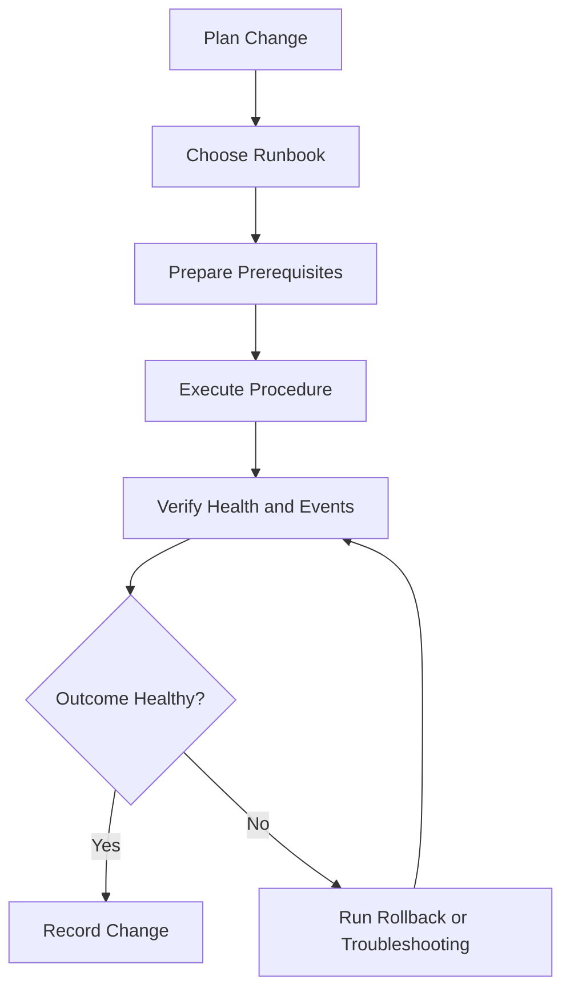

# Operations Runbooks for AWS Elastic Beanstalk

## Prerequisites

-    Access to an AWS account with permissions for Elastic Beanstalk, Amazon EC2, Elastic Load Balancing, Auto Scaling, IAM, CloudWatch, and SNS.
-    Familiarity with your application name, environment names, platform branch, and deployment workflow.
-    AWS CLI configured with a named profile, for example `--profile eb-ops`.
-    Elastic Beanstalk CLI installed for workflows that use `eb` commands.
-    Existing web server or worker environments to operate.

## When to Use

-    Use this section when operating active environments across scaling, health, security, updates, and cost management.
-    Use these runbooks for repeatable maintenance windows, incident response, and controlled change management.
-    Use these pages to keep operational actions aligned with AWS Elastic Beanstalk developer guide behavior.

## Procedure

The table below maps common operational goals to the detailed runbook pages in this section.

| Operational goal | Runbook |
| --- | --- |
| Adjust capacity and scaling policy | [scaling.md](./scaling.md) |
| Create, clone, rebuild, or swap environments | [environment-management.md](./environment-management.md) |
| Observe health and alerting behavior | [health-monitoring.md](./health-monitoring.md) |
| Apply managed platform updates safely | [updates-and-patching.md](./updates-and-patching.md) |
| Operate VPC and load balancer settings | [networking.md](./networking.md) |
| Apply security controls and audits | [security.md](./security.md) |
| Reduce infrastructure cost | [cost-optimization.md](./cost-optimization.md) |



Recommended execution sequence for changes that can affect production traffic:

1.    Confirm baseline environment health in the Elastic Beanstalk console.
2.    Save current environment configuration for recovery and consistency.
3.    Apply changes in a non-production clone where possible.
4.    Validate application behavior and Elastic Beanstalk health status.
5.    Promote via CNAME swap when using blue/green methods.
6.    Monitor environment events until the update is fully stable.

Use these standard command patterns before and after any change:

```bash
aws elasticbeanstalk describe-environments \
    --application-name "my-app" \
    --environment-names "my-app-prod" \
    --profile "eb-ops" \
    --region "us-east-1"

aws elasticbeanstalk describe-events \
    --environment-name "my-app-prod" \
    --max-records 50 \
    --profile "eb-ops" \
    --region "us-east-1"
```

Operational notes:

-    Perform environment updates through Elastic Beanstalk, not directly through underlying service consoles, to avoid configuration drift.
-    Prefer immutable or blue/green style changes for higher availability and lower operational risk.
-    Keep environment variables, tags, and option settings versioned and reviewed.
-    Use placeholders in examples to prevent exposing account-specific information.

## Verification

-    Confirm environment health is Green or the expected enhanced health status after each operation.
-    Confirm `describe-events` output shows successful completion and no unresolved warnings.
-    Confirm load balancer target health and application response paths are stable.
-    Confirm change metadata is recorded in your team runbook or change ticket.

## Rollback / Troubleshooting

-    Reapply a known-good saved configuration when a change introduces instability.
-    Rebuild a broken environment when unmanaged changes make it invalid.
-    Use clone and CNAME swap to return traffic to a previous stable environment.
-    Investigate Elastic Beanstalk events and health causes before repeating failed actions.

## See Also

-    [Managing Elastic Beanstalk environments](https://docs.aws.amazon.com/elasticbeanstalk/latest/dg/using-features.managing.html)
-    [Auto Scaling your Elastic Beanstalk environment instances](https://docs.aws.amazon.com/elasticbeanstalk/latest/dg/using-features.managing.as.html)
-    [Enhanced health reporting and monitoring in Elastic Beanstalk](https://docs.aws.amazon.com/elasticbeanstalk/latest/dg/health-enhanced.html)
-    [Managed platform updates](https://docs.aws.amazon.com/elasticbeanstalk/latest/dg/environment-platform-update-managed.html)

## Sources

-    https://docs.aws.amazon.com/elasticbeanstalk/latest/dg/using-features.managing.html
-    https://docs.aws.amazon.com/elasticbeanstalk/latest/dg/using-features.managing.as.html
-    https://docs.aws.amazon.com/elasticbeanstalk/latest/dg/health-enhanced.html
-    https://docs.aws.amazon.com/elasticbeanstalk/latest/dg/environment-platform-update-managed.html
-    https://docs.aws.amazon.com/elasticbeanstalk/latest/dg/using-features.managing.elb.html
-    https://docs.aws.amazon.com/elasticbeanstalk/latest/dg/security.html
-    https://docs.aws.amazon.com/elasticbeanstalk/latest/dg/using-features.managing.ec2.html
