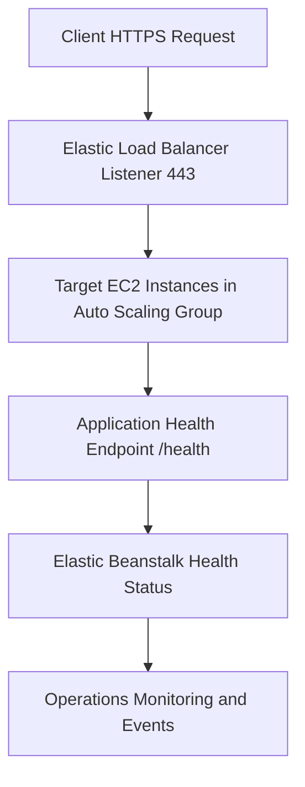

---
hide:
  - toc
---

# Networking Operations

## Prerequisites

-    Elastic Beanstalk environment running in a VPC with required subnets.
-    Permissions for Elastic Beanstalk, Amazon EC2 security groups, and Elastic Load Balancing.
-    Certificate material in AWS Certificate Manager for HTTPS listeners.
-    Defined inbound and outbound traffic policy for application and management ports.
-    Awareness of load balancer type chosen at environment creation time.

## When to Use

-    Use when configuring or adjusting VPC and subnet placement for environments.
-    Use when managing load balancer listeners, health checks, and traffic routing.
-    Use when rotating TLS certificates on HTTPS listeners.
-    Use when tightening security groups for least exposure while preserving connectivity.

## Procedure

Review current environment networking and load balancer option settings.

```bash
aws elasticbeanstalk describe-configuration-settings \
    --application-name "my-app" \
    --environment-name "my-app-prod" \
    --profile "eb-ops" \
    --region "us-east-1"
```

Set VPC and subnet configuration through environment options.

```bash
aws elasticbeanstalk update-environment \
    --environment-name "my-app-prod" \
    --option-settings Namespace=aws:ec2:vpc,OptionName=VPCId,Value=vpc-0123456789abcdef0 \
    Namespace=aws:ec2:vpc,OptionName=Subnets,Value="subnet-aaa11111,subnet-bbb22222" \
    Namespace=aws:ec2:vpc,OptionName=ELBSubnets,Value="subnet-ccc33333,subnet-ddd44444" \
    Namespace=aws:ec2:vpc,OptionName=AssociatePublicIpAddress,Value=true \
    --profile "eb-ops" \
    --region "us-east-1"
```

Configure application load balancer listeners and health check path.

```bash
aws elasticbeanstalk update-environment \
    --environment-name "my-app-prod" \
    --option-settings Namespace=aws:elasticbeanstalk:application,OptionName=Application Healthcheck URL,Value=/health \
    Namespace=aws:elbv2:listener:443,OptionName=ListenerEnabled,Value=true \
    Namespace=aws:elbv2:listener:443,OptionName=Protocol,Value=HTTPS \
    Namespace=aws:elbv2:listener:443,OptionName=SSLCertificateArns,Value=arn:aws:acm:us-east-1:<account-id>:certificate/xxxxxxxx-xxxx-xxxx-xxxx-xxxxxxxxxxxx \
    Namespace=aws:elbv2:listener:80,OptionName=ListenerEnabled,Value=true \
    --profile "eb-ops" \
    --region "us-east-1"
```

Manage EC2 instance security groups and optional default security group behavior.

```bash
aws elasticbeanstalk update-environment \
    --environment-name "my-app-prod" \
    --option-settings Namespace=aws:autoscaling:launchconfiguration,OptionName=SecurityGroups,Value="sg-0123abcd4567efgh8" \
    Namespace=aws:autoscaling:launchconfiguration,OptionName=DisableDefaultEC2SecurityGroup,Value=true \
    Namespace=aws:elbv2:loadbalancer,OptionName=SecurityGroups,Value="sg-0aaa1111bbb2222c" \
    --profile "eb-ops" \
    --region "us-east-1"
```

Rotate TLS certificate by updating listener certificate ARN.

```bash
aws elasticbeanstalk update-environment \
    --environment-name "my-app-prod" \
    --option-settings Namespace=aws:elbv2:listener:443,OptionName=SSLCertificateArns,Value=arn:aws:acm:us-east-1:<account-id>:certificate/xxxxxxxx-xxxx-xxxx-xxxx-xxxxxxxxxxxx \
    --profile "eb-ops" \
    --region "us-east-1"
```



Networking constraints from AWS docs:

-    Load balancer type is selected at environment creation and cannot be changed later.
-    Application load balancer requires VPC subnets in at least two Availability Zones.
-    Multi-instance environments require inbound rules from load balancer security group to instance security group.
-    Shared load balancer support is for application load balancer only.

## Verification

-    Confirm listener configuration includes expected protocol, port, and certificate ARN.
-    Confirm health checks return success and targets are healthy.
-    Confirm environment events report successful networking configuration update.
-    Confirm security group rules allow required traffic and block unauthorized sources.

## Rollback / Troubleshooting

-    Restore previous certificate ARN if HTTPS negotiation fails after rotation.
-    Re-enable default instance security group if custom security group rules are incomplete.
-    Correct load balancer to instance inbound rule references when instances become unreachable.
-    If ALB creation fails, verify VPC has at least two subnets across Availability Zones.
-    Revert health check URL to a known stable path if health turns unhealthy after path change.

## See Also

-    [Security](./security.md)
-    [Health Monitoring](./health-monitoring.md)
-    [Troubleshooting HTTPS Termination Issues](../troubleshooting/playbooks/networking/https-termination-issues.md)
-    [Networking Architecture](../platform/networking.md)

## Sources

-    https://docs.aws.amazon.com/elasticbeanstalk/latest/dg/using-features.managing.elb.html
-    https://docs.aws.amazon.com/elasticbeanstalk/latest/dg/environments-cfg-alb.html
-    https://docs.aws.amazon.com/elasticbeanstalk/latest/dg/environments-cfg-clb.html
-    https://docs.aws.amazon.com/elasticbeanstalk/latest/dg/environments-cfg-nlb.html
-    https://docs.aws.amazon.com/elasticbeanstalk/latest/dg/using-features.managing.ec2.instances.sg.html
-    https://docs.aws.amazon.com/elasticbeanstalk/latest/dg/environments-cfg-loadbalancer-accesslogs.html
