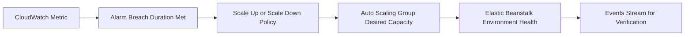

# Scaling Elastic Beanstalk Environments

## Prerequisites

-    An existing Elastic Beanstalk environment in web server tier.
-    Permissions for Elastic Beanstalk, Auto Scaling, and CloudWatch alarm configuration.
-    AWS CLI configured with a profile such as `--profile eb-ops`.
-    EB CLI configured for the same application if you use `eb scale`.
-    A known baseline of normal request rate, latency, and CPU behavior.

## When to Use

-    Use when traffic patterns are changing and static capacity is no longer efficient.
-    Use when default trigger thresholds are not aligned to your application behavior.
-    Use when you need predictable scheduled scale actions for business-hour or event-driven load.
-    Use when you must adjust desired capacity quickly during incident mitigation.

## Procedure

Start by reviewing current environment capacity and scaling configuration.

```bash
aws elasticbeanstalk describe-configuration-settings \
    --application-name "my-app" \
    --environment-name "my-app-prod" \
    --profile "eb-ops" \
    --region "us-east-1"
```

Configure trigger-based scaling using the Elastic Beanstalk trigger namespace.

```bash
aws elasticbeanstalk update-environment \
    --environment-name "my-app-prod" \
    --option-settings Namespace=aws:autoscaling:trigger,ResourceName=AWSEBCloudwatchAlarmHigh,OptionName=MeasureName,Value=CPUUtilization \
    Namespace=aws:autoscaling:trigger,ResourceName=AWSEBCloudwatchAlarmHigh,OptionName=Statistic,Value=Average \
    Namespace=aws:autoscaling:trigger,ResourceName=AWSEBCloudwatchAlarmHigh,OptionName=Unit,Value=Percent \
    Namespace=aws:autoscaling:trigger,ResourceName=AWSEBCloudwatchAlarmHigh,OptionName=UpperThreshold,Value=70 \
    Namespace=aws:autoscaling:trigger,ResourceName=AWSEBCloudwatchAlarmLow,OptionName=LowerThreshold,Value=30 \
    Namespace=aws:autoscaling:trigger,ResourceName=AWSEBCloudwatchAlarmLow,OptionName=BreachDuration,Value=5 \
    Namespace=aws:autoscaling:trigger,ResourceName=AWSEBAutoScalingScaleUpPolicy,OptionName=UpperBreachScaleIncrement,Value=1 \
    Namespace=aws:autoscaling:trigger,ResourceName=AWSEBAutoScalingScaleDownPolicy,OptionName=LowerBreachScaleIncrement,Value=-1 \
    --profile "eb-ops" \
    --region "us-east-1"
```

Set minimum and maximum instance boundaries for the Auto Scaling group.

```bash
aws elasticbeanstalk update-environment \
    --environment-name "my-app-prod" \
    --option-settings Namespace=aws:autoscaling:asg,OptionName=MinSize,Value=2 Namespace=aws:autoscaling:asg,OptionName=MaxSize,Value=6 \
    --profile "eb-ops" \
    --region "us-east-1"
```

Apply manual scaling with EB CLI for immediate capacity adjustment.

```bash
eb scale 4 --environment "my-app-prod"
```

Configure time-based scheduled scaling actions for predictable demand windows.

```bash
aws elasticbeanstalk update-environment \
    --environment-name "my-app-prod" \
    --option-settings Namespace=aws:autoscaling:scheduledaction,ResourceName=BusinessHoursScaleUp,OptionName=MinSize,Value=4 \
    Namespace=aws:autoscaling:scheduledaction,ResourceName=BusinessHoursScaleUp,OptionName=MaxSize,Value=8 \
    Namespace=aws:autoscaling:scheduledaction,ResourceName=BusinessHoursScaleUp,OptionName=DesiredCapacity,Value=4 \
    Namespace=aws:autoscaling:scheduledaction,ResourceName=BusinessHoursScaleUp,OptionName=Recurrence,Value="0 8 * * 1-5" \
    Namespace=aws:autoscaling:scheduledaction,ResourceName=AfterHoursScaleDown,OptionName=MinSize,Value=2 \
    Namespace=aws:autoscaling:scheduledaction,ResourceName=AfterHoursScaleDown,OptionName=MaxSize,Value=4 \
    Namespace=aws:autoscaling:scheduledaction,ResourceName=AfterHoursScaleDown,OptionName=DesiredCapacity,Value=2 \
    Namespace=aws:autoscaling:scheduledaction,ResourceName=AfterHoursScaleDown,OptionName=Recurrence,Value="0 20 * * 1-5" \
    --profile "eb-ops" \
    --region "us-east-1"
```

Monitor environment events and scaling outcomes after each change.

```bash
aws elasticbeanstalk describe-events \
    --environment-name "my-app-prod" \
    --max-records 100 \
    --profile "eb-ops" \
    --region "us-east-1"
```



Operational guidance from AWS docs to apply while tuning:

-    Default triggers use outbound network traffic thresholds over five-minute periods.
-    Use metrics that reflect your bottleneck, such as request count, latency, or CPU utilization.
-    Keep scheduled actions paired, with one scale-up action and one scale-down action.
-    For worker and single-instance environments, behavior differs because load balancer checks are not central.
-    Review Auto Scaling health-check configuration if you expect replacement on load balancer failures.

## Verification

-    Confirm new settings in `describe-configuration-settings` output for trigger and scheduled namespaces.
-    Confirm Auto Scaling desired capacity changes during threshold breach or scheduled times.
-    Confirm environment events show successful scaling activity and stable health.
-    Confirm request latency and error rate remain within acceptable operating range.

## Rollback / Troubleshooting

-    Revert trigger thresholds to previous values if scaling oscillates.
-    Disable or suspend scheduled actions that conflict with real traffic behavior.
-    Increase breach duration if transient spikes trigger unnecessary scale-out.
-    Inspect CloudWatch metrics, alarm dimensions, and units if triggers appear inactive.
-    If scale-in is too aggressive, reduce down increment magnitude and raise lower threshold.

## See Also

-    [Health Monitoring](./health-monitoring.md)
-    [Cost Optimization](./cost-optimization.md)
-    [Environment Management](./environment-management.md)
-    [How Elastic Beanstalk Works](../platform/how-elastic-beanstalk-works.md)

## Sources

-    https://docs.aws.amazon.com/elasticbeanstalk/latest/dg/using-features.managing.as.html
-    https://docs.aws.amazon.com/elasticbeanstalk/latest/dg/environments-cfg-autoscaling-triggers.html
-    https://docs.aws.amazon.com/elasticbeanstalk/latest/dg/environments-cfg-autoscaling-scheduledactions.html
-    https://docs.aws.amazon.com/elasticbeanstalk/latest/dg/environmentconfig-autoscaling-healthchecktype.html
